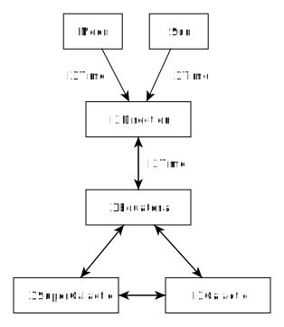

.. @copyright (C) 2015 The IceCube Collaboration
.. 
.. $Id$
..
.. @author Kevin Meagher
.. @date August 2015
.. $Rev$
.. $LastChangedBy$
.. $LastChangedDate$

.. _astro:

astro
~~~~~

This project provides functions for converting between local IceCube coordinates
and astronomical coordinates. 

Maintainer: Kevin Meahger 

Overview
========

All reconstructions of IceCube events calculate the direction in terms of
IceCube coordinates which is a local coordinate system defined in reference
to the geography at the South Pole, usually defined in terms of the zenith and
azimuth angles. In order to perform astronomical analyses with IceCube data it
is necessary to transform these coordinates into the standard astronomical
coordinate systems: equatorial, galactic and supergalactic, which are defined
with respect to the stars. Functions for locating the Sun and Moon are also
provided. In a typical IceCube analysis, only a few astronomical
coordinate transformations are needed to transform from local to equatorial.
Astro only provides the coordinate transformations which are
commonly used in IceCube analyses. Coordinate systems which are typically unneeded,
such as current equatorial and multiple epochs, are intentionally omitted to avoid confusion.

This project provides functions in both C++ and python.
In C++, structs for storing equatorial (J2000) and galactic
coordinates are provided, and the function all use
:doc:`I3Direction </projects/dataclasses/i3direction>` for storing local
coordinates.
Many python functions are also provided, these will make use of the structs
used in C++ as well as numpy array functions which take the coordinates separately.
The following diagram gives an overview of the functions provided
by this project:

Background
==========

Astronomical objects are most commonly located in the celestial sphere by a coordinate
system referred to as the equatorial coordinate system. This is the system in which the
universe is 'at rest', aside from solar system objects, and stars near the solar system,
astronomical objects do not move in equatorial coordinates. 
Equatorial coordinates are defined such that they have the same equator and poles as the Earth.
The coordinates in
this system are Right Ascension (commonly abbreviated  *RA* or *α*) and Declination
(commonly abbreviated *Dec* or *δ*). In addition, a galactic coordinate system
is defined in which is centered a the the galaxy lies along the equator and is centered at
longitude =0°. This coordinate system uses galactic longitude (abbreviated *l*)
and galactic latitude (abbreviated *b*) as coordinates.
Supergalactic coordinates which were designed to have their equator aligned
with the supergalactic plane, a major structure in the local universe formed by
the preferential distribution of nearby galaxy clusters, are also occasionally
used as well.

A complete discussion of these coordinate systems is beyond the scope of this
document. For those interested in an introduction to positional astronomy,
a good introduction can be found
`here <http://star-www.st-and.ac.uk/~fv/webnotes/index.html>`_.

All reconstructions in icetray are performed in a local coordinate system
defined for IceCube. This system is centered at the approximate center of the
IceCube detector. The coordinates are aligned with the standard Antarctic grid
coordinates with the x-axis pointing toward Grid East, the y-axis pointing
toward Grid North, and the z-axis pointing toward the vertical.
More information can be found on the wiki for the
:wiki:`The IceCube Coordinate System <Coordinate_system>`.

Directional information in IceCube is almost always described using spherical
coordinate system angles. Zenith angle is defined as angle to the vertical,
and azimuth angle is defined as the angle along the xy-plane counter clockwise
from the x-axis. so that the ordinal directions are: Grid East(0°) =>
Grid North(90°) => Grid West(180°) => Grid South(0°).
This coordinate system is defined to be different than the local coordinate
system typically used by astronomers. Astronomers typically use altitude as the
angle above the horizon and azimuth defined as clockwise from North which
will give ordinal directions North(0°) => East(90°) => South(180°)
=> West(270°).
For the convenience of IceCubers who are used to the IceCube coordinate system
and are likely to be confused by convert to standard astronomical local coordinates,
astro does not deal with astronomical local coordinates and converts directly
from IceCube coordinates to equatorial coordinates. 

Unfortunately, the equatorial coordinate system can be ambiguous, although the direction of the
Earth's poles and equator is stable on the short term. The position of the poles slowly moves
due to the torque of the sun and moon on the Earth's equatorial bulge. To compensate for this
RA and dec positions are accompanied by an epoch, since 1984 most astronomical catalogs have
used the J2000 epoch, previous epoch were B1900 and B1950 (The J and B stand for Julian and
Besselian respectively which are different ways of defining epochs.) Astro uses J2000 exclusively
if another epoch becomes common, new function names can be added. Some times observations are
given in coordinates of apparent or current epoch, these coordinates should be considered an
intermediate calculation and no support is provided for them.

Python Array Interface
======================

The most common way to use astro is in python using the numpy array interface.
These function use numpy array broadcasting which can be used with both
scalars and numpy arrays.

Forward Transformations
-----------------------

Convert from local coordinates to equatorial, galactic, and supergalactic:

* :py:func:`icecube.astro.dir_to_equa` -  Get the equatorial coordinates
  (right ascension and declination) of an IceCube event (``zenith`` and ``azimuth``) at a given time (``mjd``).
* :py:func:`icecube.astro.equa_to_gal` -  Get the Galactic coordinates ``l`` and ``b`` of an
  equatorial coordinate (Right Ascension and Declination).
* :py:func:`icecube.astro.equa_to_supergal` - Get the supergalactic coordinates ``SGL`` and ``SGB``
  from equatorial coordinates ``ra`` and ``dec``
* :py:func:`icecube.astro.gal_to_supergal` -  Get the supergalactic coordinates ``SGL`` and ``SGB``
  from galactic coordinates ``l`` and ``b``
    
.. note::
   Since the conversion from local to equatorial coordinates is rather complicated
   but the conversions between equatorial, galactic, and supergalactic are comparatively
   complicated, it is necessarily to first convert local to equatorial and then convert
   the results to galactic or supergalactic.

Sun and Moon
------------
   
Analyses of the Sun and Moon are typically done in local coordinates, so the functions
will return local coordinates for a given time: 
 
* :py:func:`icecube.astro.sun_dir` - Get the location of the Sun in IceCube local coordinates
  `zenith` and `azimuth` for a given time in `mjd`
* :py:func:`icecube.astro.moon_dir` - Get the location of the Moon in IceCube local coordinates
  `zenith` and `azimuth` for a given time in `mjd`

Convenience Functions
---------------------

These Functions are provided for convenience

* :py:func:`icecube.astro.angular_distance` - calculate the angular distance along the great circle 
  on the surface of a sphere between the points
  (`lon1`,`lat1`) and (`lon2`,`lat2`)
* :py:func:`icecube.astro.tables_to_equa` - Get the equatorial coordinates (right ascension and 
  declination) of IceCube's Events from tables written by 
  tableio. Works with hdf5 tables written by hdfwriter
  and read by pytables, h5py, or pandas
* :py:func:`icecube.astro.fractional_mjd` - This is a convenience function to
  convert the MJD information provided by the standard tableio booking to a fractional MJD.
 
Reverse Transformations
-----------------------

Most analyses are performed in one of the celestial coordinate systems, however,
it is sometimes necessary to transform back from a celestial coordinate systems
back to local coordinate systems.

* :py:func:`icecube.astro.equa_to_dir` - Get the IceCube `zenith` and `azimuth` of an
  equatorial coordinate (Right Ascension and Declination)
  at a given time `mjd`.

  .. warning::
     This function is significantly slower than :py:func:`dir_to_equa`, 
     it is highly recommended that if you need to perform a significant number
     of calculations that you go from local to equatorial coordinates and 
     perform the analyses in equatorial coordinates, rather than the reverse.
    
* :py:func:`icecube.astro.gal_to_equa` - Get the equatorial coordinates (Right Ascension 
  and Declination) from  Galactic coordinates 
  `l` and `b`
* :py:func:`icecube.astro.supergal_to_equa` - Get the galactic coordinates 'l' and 'b'
  from supergalactic coordinates 'SGL' and 'SGB'
* :py:func:`icecube.astro.supergal_to_gal` -  Get the equatorial coordinates `ra` and `dec`
  from supergalactic coordinates `SGL` and `SGB`

Examples
--------

Simple transformation from zenith and azimuth to ra and dec and compare with the
location of the Crab Nebula.

.. code-block:: python

   import tables
   import numpy as np
   from icecube import astro

   with tables.openFile('tableio.h5') as f:
   
     mjd = (f.root.I3EventHeader.cols.time_start_mjd_day[:]+
            f.root.I3EventHeader.cols.time_start_mjd_sec[:]/86400.)
     zenith  = f.root.OnlineL2_BestFit.cols.zenith[:]
     azimuth = f.root.OnlineL2_BestFit.cols.azimuth[:]

     ra,dec = astro.dir_to_equa(zenith,azimuth,mjd)

     print np.degrees(ra)
     print np.degrees(dec)

     #calculate distance to the Crab Nebula
     print astro.angular_distance(ra,dec,
                                  np.radians(83.6330
                                  np.radians(22.01450)
                                  )

These table functions are provided to make using ``astro`` with data written by :ref:`tableio <tableio-main>` with ``I3HDFWriter`` as easy as possible. Tables read with ``pytables``, ``h5py`` and ``pandas`` work equally well.

.. code-block:: python

    # using pytables
    f = tables.openFile('foo.hdf5')
    ra,dec= tables_to_equa(f.root.Particle,
                           f.root.I3EventHeader)

    #using h5py
    f= h5py.File('foo.hdf5')
    ra,dec = tables_to_equa(f["Particle"],
                            f["I3EventHeader"])

    #using pandas
    p = pandas.read_hdf('foo.hdf5','Particle')
    h = pandas.read_hdf('foo.hdf5','I3EventHeader')
    ra,dec = tables_to_equa(p,h)

Python Dataclasses Interface
============================

These function provided an the coordinate transformations through an icetray
dataclasses interface which uses classes such as ``I3Direction`` to store
coordinates.

Container Classes
-----------------

These are the base classes used to store information and pass to functions:

* :py:class:`icecube.dataclasses.I3Time` - Store time, many different time
  formats are supported.
* :py:class:`icecube.dataclasses.I3Direction` - Store local coordinates, transformations
  to cartesian coordinates available.
* :py:class:`icecube.astro.I3Equatorial` - Struct to store Equatorial coordinates in the J2000
  Epoch
* :py:class:`icecube.astro.I3Galactic` - Struct to store galactic coordinates
* :py:class:`icecube.astro.I3SuperGalactic` - Struct to store supergalactic coordinates
  

Forward Transformations
-----------------------

Convert from local coordinates to equatorial, galactic, and supergalactic:

* :py:func:`icecube.astro.I3GetEquatorialFromDirection` - Convert an IceCube direction to J2000 equatorial coordinates system at a given time
* :py:func:`icecube.astro.I3GetGalacticFromEquatorial` - Convert from Equatorial (J2000) to Galactic (IAU 1958) coordinate system
* :py:func:`icecube.astro.I3GetSuperGalacticFromEquatorial` - Convert from Equatorial (J2000) to Supergalactic (de Vaucouleurs) coordinate system

Sun and Moon
------------

* :py:func:`icecube.astro.I3GetMoonDirection` - Returns the direction of the Moon in local IceCube coordinates at a given time
* :py:func:`icecube.astro.I3GetSunDirection` - Returns the direction of the Sun in local IceCube coordinates at a given time
 
Time functions
-----------------

* :py:func:`icecube.astro.I3GetGMST` - Returns the Greenwich Mean Sidereal Time
* :py:func:`icecube.astro.I3GetGMAST` - Returns the Greenwich Mean Anti Sidereal Time
* :py:func:`icecube.astro.I3GetGMEST` - Returns the Greenwich Mean Extended Sidereal Time

Reverse Transformations
-----------------------
* :py:func:`icecube.astro.I3GetDirectionFromEquatorial` -Convert an astronomical
  position in J2000 equatorial coordinates to local IceCube coordinates at a given time
* :py:func:`icecube.astro.I3GetEquatorialFromGalactic` - Convert from Galactic (IAU 1958)
  to Equatorial (J2000) coordinate system
* :py:func:`icecube.astro.I3GetEquatorialFromSuperGalactic` - Convert from Supergalactic
  (de Vaucouleurs) to Equatorial (J2000) coordinate system
* :py:func:`icecube.astro.I3GetGalacticFromSuperGalactic` - Convert from Supergalactic
  (de Vaucouleurs) to Galactic (IAU 1958) coordinate system
* :py:func:`icecube.astro.I3GetSuperGalacticFromGalactic` - Convert from Galactic
  (IAU 1958) to Supergalactic (de Vaucouleurs) coordinate system
                
Constants
---------

* :py:const:`icecube.astro.ICECUBE_LATITUDE` - Latitude (WGS 84) of the origin of the IceCube coordinate system
* :py:const:`icecube.astro.ICECUBE_LONGITUDE` - Longitude (WGS 84) of the origin of the IceCube coordinate system
                   
C++ Interface
=============

I3Astro provides 3 container classes:

* :cpp:class:`I3Equatorial` for storing J2000 coordinates      
    :``ra``: Right ascension in radians
    :``dec``: Declination in radians    
* :cpp:class:`I3Galactic` for storing IAU1958 galactic coordinates     
    :``l``: Galactic Longitude in radians
    :``b``: Galactic Latitude in radians
* :cpp:class:`I3SuperGalactic` for storing de Vaucouleurs supergalactic coordinates
    :``l``: Galactic Longitude in radians
    :``b``: Galactic Latitude in radians

* :cpp:func:`I3GetGMST` - Convert from I3Time to sidereal time (GMST)
* :cpp:func:`I3GetGMAST` - Convert from I3Time to antisidereal time (GMAST)
* :cpp:func:`I3GetGMEST` -  Convert from I3Time to extended-sidereal time (GMEST)
* :cpp:func:`I3GetMoonDirection` Gets the direction of the Moon in local IceCube coordinates at a certain time
* :cpp:func:`I3GetSunDirection` Gets the direction of the Sun in local IceCube coordinates at a certain time
* :cpp:func:`I3GetDirectionFromEquatorial` Convert a an position in J2000 equatorial coordinates to local IceCube coordinates at a given time
* :cpp:func:`I3GetEquatorialFromDirection` Convert an IceCube direction to J2000 equatorial coordinates system at a given time
* :cpp:func:`I3GetGalacticFromEquatorial` Convert from Equatorial (J2000) to Galactic (IAU 1958) coordinate system
* :cpp:func:`I3GetEquatorialFromGalactic` Convert from Galactic (IAU 1958) to Equatorial (J2000) coordinate system
* :cpp:func:`I3GetSuperGalacticFromGalactic` Convert from Galactic (IAU 1958) to SuperGalactic (de Vaucouleurs) coordinate system
* :cpp:func:`I3GetGalacticFromSuperGalactic` Convert from SuperGalactic (de Vaucouleurs) to Galactic (IAU 1958) coordinate system
* :cpp:func:`I3GetSuperGalacticFromEquatorial` Convert from Equatorial (J2000) to SuperGalactic (de Vaucouleurs) coordinate system
* :cpp:func:`I3GetEquatorialFromSuperGalactic` Convert from SuperGalactic (de Vaucouleurs) to Equatorial (J2000) coordinate system

Tableio Converters
==================

I3Astro provides 4 :ref:`tableio <tableio-main>` converters:

* :js:data:`I3AstroConverter` - Books equatorial coordinates 
* :js:data:`I3GalacticConverter` - Books galactic coordinates 
* :js:data:`I3SuperGalacticConverter` - Books supergalactic coordinates
* :js:data:`I3SunAndMoonConverter` - Books the location of the Sun and moon for a timestamp provided by :cpp:class:`I3EventHeader`

Example:

.. code-block:: python

   tray.Add(tableio.I3TableWriter,
            output="foo.hdf5",
            SubEventStreams=['in_ice'],
            keys = {'Particle': [ dataclasses.converters.I3ParticleConverter(),
                                  astro.converters.I3AstroConverter(),
                                  astro.converters.I3GalacticConverter(),
                                  astro.converters.I3SuperGalacticConverter(),
                                  ],
                    'I3EventHeader' : [ dataclasses.converters.I3EventHeaderConverter(),
                                        astro.converters.I3SunAndMoonConverter()]
                   }
                   
Accuracy
========

Positional astronomy calculations can be extremely accurate, standard software such as PAL
can achieve milliarcsecond precision when all of the corrections are applied correctly.
However for IceCube data, muon/cascade reconstruction error is the dominant
source of angular uncertainty, this is typically O(1°) for muon neutrinos and higher for
cascades.
None of the corrections typically applied by these packages (save nutation)
are necessary to achieve the necessary level of accuracy for an IceCube analysis. 
However, discussion of positional astronomy often lead to arguments about what corrections
are appropriate to apply.
The following table and discussion is intended to provide context to any future
discussions about which corrections are appropriate to apply.

+------------------------+------------+-------------+---------------------------+
| Effect                 | Magnitude  | included in | Remark                    |
|                        |            | calculation |                           |
+========================+============+=============+===========================+
| proper motion and      | source     |             | only affects stars close  |
| parallax               | dependent  | No          | to the solar system       |
+------------------------+------------+-------------+---------------------------+
| precession             | 50"/yr     | Yes         | relative to the year 2000 |
+------------------------+------------+-------------+---------------------------+
| nutation               | < 11"      | Yes         |                           |
+------------------------+------------+-------------+---------------------------+ 
| annual aberration      | < 20.5"    | Yes         |                           |
+------------------------+------------+-------------+---------------------------+
| light deflection       | < 1.74"    | Yes         | only near the sun limb    |
+------------------------+------------+-------------+---------------------------+
| Sun positional         |            |             |                           |
| uncertainty            |  5"        |             |                           |
+------------------------+------------+-------------+---------------------------+
| Moon positional        |            |             |                           |
| uncertainty            | 30"        |             |                           |
+------------------------+------------+-------------+---------------------------+
| diurnal aberration     | < 0.3"     | Yes         |                           |
+------------------------+------------+-------------+---------------------------+
| refraction             | < 0.5°     | No          | Cosmic Rays and Neutrinos |
|                        |            |             | are not refracted         |
+------------------------+------------+-------------+---------------------------+
| polar motion           | < 0.3"     | No          |                           |
+------------------------+------------+-------------+---------------------------+
| UT1-UTC offset         | < 13.5"    | No          |                           |
+------------------------+------------+-------------+---------------------------+
| IceCube Not at Exact   |            |             |                           |
| South Pole             | 32"        | Yes         |                           |
+------------------------+------------+-------------+---------------------------+
| IceCube Size           | < 16"      | No          |                           |
+------------------------+------------+-------------+---------------------------+
| Glacial flow           | 0.3"/yr    | No          | relative to 2011          |
+------------------------+------------+-------------+---------------------------+

Nutation, annual aberration, and light deflection are included in the same function as
precession so it is easier to include them than to exclude them. (Also if they are included the
accuracy of the package can be compared with other high accuracy astronomy software.)

Parallax and proper motion only effect stars within O(10 parsecs) of the solar system.
This can be ignored as there are no IceCube analyses which study objects at this distance.
To calculate polar motion and UT1-UTC it is necessary to downloading data files from the
International Earth Rotation and Reference System Service (IERS) which are updated on a monthly
basis.
Due to the hassle of downloading and making sure these files are up to date, these correction
are omitted.

The quoted Sun and Moon uncertainties are the uncertainties of the algorithm used to predict the
position of the moon and sun by PAL.

Astro uses geographic position 89°59'39.84" South, 62°36'29.16" West (-89.9944°N,-62.6081°E)
as the location of IceCube observations.
This value is taken from the 2011 position of the South Pole in IceCube coordinates system on the
:wiki:`wiki <Coordinate_system>`.
IceCube reconstructions calculate zenith and azimuth angles relative to a position
near the center of gravity of the hits, which can be up to 500 m from the center of the
detector. No effort is made to correct for this. 
In addition, the geographic location of IceCube move with the glacial flow of the
antarctic ice at a rate 10 m/yr no effort is made to correct for this either. 

Dependencies
============

Astronomical calculation are done using PAL.
PAL is a reimplementation of `SLALIB <http://star-www.rl.ac.uk/docs/sun67.htx/sun67.html>`_ which is
is an old Fortran library which was translated into c, it is no longer updated,
has a weird license, and is hard to find.
`PAL <https://github.com/Starlink/pal>`_ is a newer library which is available on github and is
licensed with LGPL.
PAL is intended as a newer version of SLALIB and has an identical interface so it can function as a drop-in replacement.
Instructions for downloading it can be found in the :ref:`cmake tools documentation <pal-tool>`.

See Also
========

.. toctree::
   :maxdepth: 1

   release_notes
   code_review
   Python API Reference </python/icecube.astro>
   C++ API Reference </doxygen/astro/index>
   IceTray Inspect Reference </inspect/astro>

