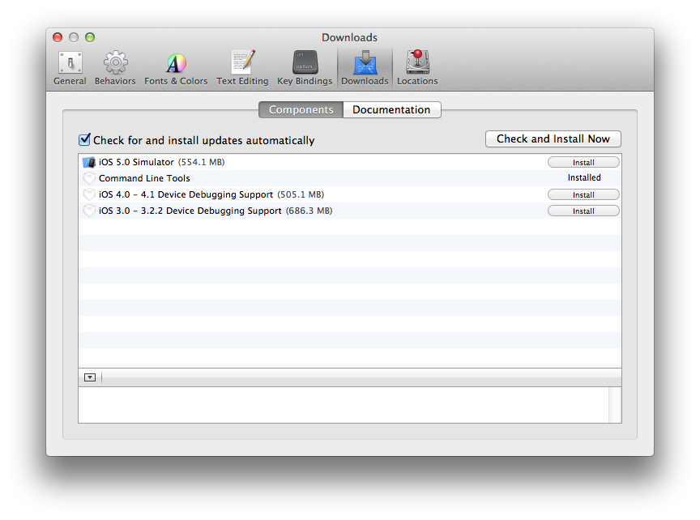

Apple MacOS
^^^^^^^^^^^

IceTray requires some additional support software to build and function. Before
you gallop off and try to install all of the dependencies by hand, please read
these notes in their entirety. Especially:

.. warning::

   Do not try to install your own Python over the perfectly good version
   shipped with homebrew. It is very likely to end in tears. This
   includes the Even though and Anaconda distributions. In order to compile
   IceTray, your version of boost::python must be compiled against the same
   version of python as you are using. It will not be easy to do this with
   Anaconda.

Developer Tools
"""""""""""""""

You'll need a compiler in order to build the IceCube software. Apple distributes
clang and llvm-gcc both as a stand-alone download and as part of its Xcode IDE,
but requires you to register for an `Apple ID`_  before you can download either
one. The Xcode download is 10 times larger than the command-line tools package,
so you should only download it if you need it for non-IceCube work.

.. _`Apple ID`: https://appleid.apple.com

Command-Line Tools
..................

1) Go to the `Apple Developer Downloads page <http://developer.apple.com/downloads>`_,
   signing in with your `Apple ID`_.
2) Download and install the latest Command Line Tools.

Alternatively you can just type ``xcode-select --install`` at the command-line to install
the command line tools.

Xcode
.....

1) Download Xcode from the App Store.

2) Open Xcode, and open the Preferences window (Xcode > Preferences).

3) In the :ref:`Xcode4Prefs`, click the Downloads tab, and install the
   Command Line Tools.

.. _Xcode4Prefs:

	
	Xcode Preferences window

After the install finishes you should have both clang and llvm-gcc:

.. code-block:: sh
	
	bash-3.2$ g++ --version
	i686-apple-darwin11-llvm-g++-4.2 (GCC) 4.2.1 (Based on Apple Inc. build 5658) (LLVM build 2336.11.00)
	Copyright (C) 2007 Free Software Foundation, Inc.
	This is free software; see the source for copying conditions.  There is NO
	warranty; not even for MERCHANTABILITY or FITNESS FOR A PARTICULAR PURPOSE.

	bash-3.2$ clang++ --version
	Apple clang version 4.0 (tags/Apple/clang-421.0.60) (based on LLVM 3.1svn)
	Target: x86_64-apple-darwin12.0.0
	Thread model: posix

Homebrew
""""""""

:doc:`../homebrew` is probably the easiest way to install packages on MacOS, and
distributes the most heavy-weight dependencies (cmake, boost, and Qt) as binary
packages.  Install them like this::

  brew install cmake

The following formulae are necessary to compile IceTray:

  cmake python boost boost-python3 gsl wget

The following formulae are recommended for optional functionality of components of IceTray:
  
  cdk qt libarchive doxygen cfitsio hdf5 nlopt minuit2 suite-sparse healpix zstd

Most of the recommended formulae are in the main distribution, but IceCube
maintains a `tap`_ for uncommon software that IceTray depends on.
The following formula are also recommended from the IceCube-SPNO/icecube tap:

  pal cppzmq

.. _tap: https://github.com/Homebrew/homebrew/blob/master/share/doc/homebrew/brew-tap.md

ROOT on MacOS
"""""""""""""

IceTray also depends on ROOT. The fastest way to install root on MacOS is to
download the recompiled binary tar file from `cern`_.
ROOT can also be installed with homebrew::

.. code-block:: sh
                
   brew install --build-from-source root

Either way you need the load the ``thisroot.sh`` into your environment
before you run ``cmake``.

.. code-block:: sh

   . /usr/local/bin/thisroot.sh
   
.. _cern: https://root.cern.ch/downloading-root

.. _osxpythonsetup:
  
Python on MacOS
"""""""""""""""

.. highlight:: sh

Apple has done a fairly decent of including a recent version of python2 in
MacOS. But now that IceTray is transitioning to python3 it is necessary to
compile IceTray against python3. The previous section described the easiest
way to install python3 on MacOS: using homebrew.

With python3 installed with homebrew the :command:`python` command will still refer
to the system python, but python3 will refer to python3. IceTray will
automatically detect the homebrew version of python and link against it.
Python3 packages can be installed with the :command:`pip3` command, and ipython
can be accessed with :command:`ipython3` etc.

IceTray relies on a number of python packages to work, the easiest way to
instal them is with :command:`pip3`. If python3 is installed with homebrew, pip3 will
install them to ``/usr/local/lib/python3.7/site-packages`` and any scripts
will be linked to in ``/usr/local/bin/`` which is automatically pathed.

The following python packages are recommended for icetray:

  numpy scipy matplotlib sphinx ipython qtconsole tables

Step-By-Step Instructions
"""""""""""""""""""""""""

With a fresh install of Mojave I was able to get combo running by running the following commands:

.. code-block:: sh

   #install xcode command line tools (don't worry if it says it is already installed)
   xcode-select --install
   
   #install homebrew
   /bin/bash -c "$(curl -fsSL https://raw.githubusercontent.com/Homebrew/install/master/install.sh)"
   
   #install packages with homebrew
   brew install subversion cmake python boost boost-python3 cdk qt libarchive wget doxygen cfitsio hdf5 nlopt gsl minuit2 suite-sparse healpix zstd

   #install brews written by icecube 
   brew tap IceCube-SPNO/homebrew-icecube
   brew install pal cppzmq

   #create and enter virutal envionment
   /usr/local/opt/python@3.8/bin/python3 -m venv ${HOME}/py38/
   source ${HOME}/py38/bin/activate
   
   #install python packages with pip3
   pip install --upgrade pip
   pip install numpy scipy matplotlib sphinx ipython qtconsole tables pandas
               
This worked in May 2020, with the trunk of combo on MacOS Mojave. As homebrew updates, these instructions might not work as well. Your mileage may vary.

