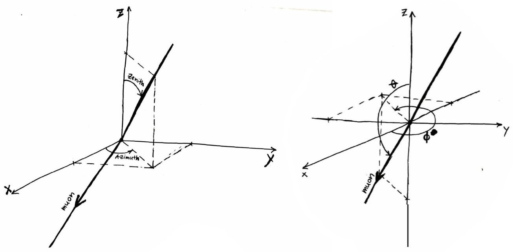

.. icecube-coordinates

==================
Coordinate Systems
==================

Because of IceCube's unique location at the South Pole, care must be taken to understand the coordinate
systems used in IceCube. This page describes the various coordinate systems used by IceCube. 

IceCube Coordinate System
=========================

All quantities in icetray software use the IceCube coordinate system. 
This includes classes such as :ref:`I3Position` and :ref:`I3Direction` as well as classes which use these
classes such as :ref:`I3Particle`. 
The IceCube coordinate system is a local Cartesian coordinate system for measuring the location of DOMs as well 
as positions and velocities of particles as they pass through the vicinity of the detector. 
All lengths are measured in meters.

Orientation
-----------

IceCube follows the convention standard in physics to use a right had coordinate system such that 
:math:`\hat{x}\times\hat{y}=\hat{z}`.
The coordinate system is aligned so that +x points toward Grid East, +y points towards Grid North, 
and +z points straight up, away from the Earth.
Grid North is aligned with the prime meridian, pointing towards Greenwich, UK
and Grid East is aligned with the 90th Meridian East, pointing towards Nepal.

These definitions were chosen to use axes with the same directions as in the
AMANDA coordinate system (see below), but with a different origin.

.. Figure:: Rectangular_coordinates.png
  :alt: Rectangular coordinate system.

  This figure illustrates the IceCube uses a right handed coordinate system.

Origin
------

The origin of this coordinate systems was chosen to be close to the center of the in-ice array based on the
surveyed location of the strings markers before construction.
Note that this was defined for the an 80 string detector which was before DeepCore Strings were added and
before strings 79 and 80 were relocated from the north east corner to the center of the array.
The exact location or the origin was rounded to the nearest to the nearest 100 ft in survey coordinates (see below).
The origin is at a depth of approximately 1950 m from the surface of the ice.
The closes string to the origin is String 86 at (-10 m, +7 m).
However, because String 86 is a DeepCore string. all the DOMs are separated from the origin vertically leaving the 
closest DOM to the origin is DOM 30 on string 36 located at approximately (+46 m, -35 m, +7 m).

Depth
-----

The official meaning of depth in IceCube is the vertical distance from the floor of the 
tower used for deployment of String 21, the first IceCube string. 
For every string, the location of the tower is surveyed before deployment. 
The tower floor for String 21 was at an elevation of 9291.31 ft (2832 m), defining the ice surface elevation

.. math::

    \mathrm{ice\_surface\_elevation} = 9291.31\;\mathrm{ft} = 2832\;\mathrm{m}

With the origin of the coordinate system being set to 2900 ft (883.9 m), the z-coordinate of the ice surface is

.. math::

    z_\mathrm{surface} = 1948.07\;\mathrm{m}

Consequently, the depth is related to the :math:`z` coordinate through

..  math::

    d = 1948.07 - z

This table gives a list of important reference points for depths

=====================  =================   ==================
Reference Point        Global Coordinate   IceCube Coordinate
=====================  =================   ==================
Bedrock Depth                    -2832 m               -830 m
IceCube String Depth    -2450 to -1450 m       -500 to +500 m
DeepCore String Depth   -2450 to -2100 m       -500 to -150 m
Dust Layer Depth        -2100 to -2000 m       -150 to  -50 m 
=====================  =================   ==================

Spherical Coordinates
---------------------

Particles passing through IceCube often have their direction described in spherical coordinates.
IceCube uses the definition standard in physics: zenith angle is the angle between the particle
and the vertical (+z) direction. Azimuth is the projection in the xy-plane measured 
counterclockwise from the +x direction such that the +y direction is at azimuth=90°.

    Diagram of a the Spherical Coordinates used in IceCube. A particle with a source in the +x, +y, and +z
    direction travels through the detector with zenith and azimuth directions marked. Zenith is the
    angle between the particle's source and vertical. Azimuth is the projection of the particles 
    source projected in the xy-plane measured counterclockwise from the +x axis.

There seems to be a broad consensus that the location of objects should be described by a vector from the
origin to the object in question.
However, there seems to be no general convention on how to orient velocity vectors for objects in motion.
For example, a North wind describes air molecules originating in the North and traveling southward. 
While an airplane with a North flight vector is traveling the opposite direction.
In astronomy, a telescope pointed North describes a telescope positioned to observe photons traveling from
North to South. 
Here IceCube follows the astronomy convention: an azimuth of 0° describes a particle traveling from Grid
East to Grid West and an azimuth of 90° describes a particle traveling Grid North to Grid South.

  Two simulated events traveling horizontally are shown to illustrate the orientation of the azimuth angles.
  The figure on the left shows a particle with azimuth=0° traveling *from* Grid East *toward* Grid West.
  On the right, a particle with azimuth=90° traveling *from* Grid North *toward* Grid South.

Definition of "Northern" and "Southern sky"
-------------------------------------------

The terms "northern" and "southern sky", as used for IceCube, denote the halves of the celestial spheres as
observed from the Geographical South Pole rather than terrestrial hemispheres.
The figure shows an attempt of a visualization.

    Definition of "northern" and "southern" sky for IceCube

It also shows the definition of surface- and detector-centered zenith angles, :math:`\beta` and
:math:`\theta`, for a detector buried at depth :math:`d` below the surface of a sphere of radius :math:`r`.
The overburden :math:`o` is the distance from the detector to the surface of the sphere and is a function
of the detector-centered zenith angle :math:`\theta`.
The local zenith angle at the impact point of an air shower that would hit the detector is :math:`\beta`, and the colatitude
(Earth-centered) angle of the impact point is :math:`\alpha`.

Survey Coordinates
==================

The US Antarctic uses a different coordinate system for surveying the building in and around the 
South Pole Station.
All maps and planning documents related to construction of IceCube use this coordinate system.
Like the IceCube Coordinate System the survey coordinates are a local coordinate system that moves with the ice.
Survey coordinates are given in Northings, Eastings, and (NCEL) elevation, all in feet.
The foot is a unit which may be unfamiliar to those from outside the US,
it is defined to be exactly 0.3048 meters and the official abbreviation is ``ft``,
however it is often denoted with the prime symbol: ``′``.
Northings are along the IceCube y axis and Eastings are along the x axis.
The "origin" is at a control point near the Dome, but to avoid negative numbers 50,000 ft are always added
to both Northings and Eastings.
Typical Northings in IceCube are in the range 50,500-54,000 ft, and typical Eastings are in the range 44,500-48,500 ft. 

Conversion to IceCube coordinates
---------------------------------

Survey surface coordinates are converted to IceCube (x,y) coordinates through 

.. math::

    x\;[\mathrm{m}] = 0.3048\cdot(\mathrm{Easting}\;[\mathrm{ft}]-46500)

    y\;[\mathrm{m}] = 0.3048\cdot(\mathrm{Northing}\;[\mathrm{ft}]-52200)

Survey azimuth
--------------

USAP surveys follow standard US surveying practice for calculating azimuths which also differs
from the IceCube coordinate system.
Survey coordinates use local Grid North as the control meridian and are measured clockwise from there.
This means that survey azimuths are offset 90° and measured in the opposite direction from IceCube
azimuths.
As always with azimuths it is very important if there is any ambiguity to specify
which control meridian is being used and whether you are using clockwise or counterclockwise rotation.

The conversions between IceCube azimuth and survey azimuth are:

.. math::

    \mathrm{Azimuth_survey} = 90^{\circ} - \mathrm{Azimuth_IceCube}

    \mathrm{Azimuth_IceCube} = 90^{\circ} - \mathrm{Azimuth_survey}

    The location of IceCube strings are shown in both IceCube and Survey Coordinates. In addition, the azimuth 
    direction of both the ice flow and ice layer tilt is shown. Note that coincidentally the tilt has azimuth=225° 
    in both azimuth conventions. 

To remove all ambiguity, the table below shows four geographical meridians and their directions in both the
IceCube and survey coordinate systems.

+---------------------+--------------------+--------------+-----------------+-------------+----------------+
| Geographic Meridian | Travel Destination | IceCube Grid | IceCube Azimuth | Survey Grid | Survey Azimuth |
+=====================+====================+==============+=================+=============+================+
| 90° E               | Nepal              | +x           | 0°              | Grid East   | 90°            |
+---------------------+--------------------+--------------+-----------------+-------------+----------------+
| 0°                  | Greenwich          | +y           | 90°             | Grid North  | 0°             |
+---------------------+--------------------+--------------+-----------------+-------------+----------------+
| 90° W               | New Orleans        | −x           | 180°            | Grid West   | 270°           |
+---------------------+--------------------+--------------+-----------------+-------------+----------------+
| 180°                | Fiji               | −y           | 270°            | Grid South  |  180°          |
+---------------------+--------------------+--------------+-----------------+-------------+----------------+

Elevation
---------

Elevations from surveys at the South Pole are initially given in a local reference frame (as so-called NCEL elevations), relative to a local control point (established by the U.S. Navy) which was once at the surface. The IceCube coordinate system is defined relative to the Mean Sea Level. All surveyed elevations are therefore translated to MSL elevations before converted to IceCube coordinates.

| **NCEL** stands for Navy Civil Engineering Laboratory
| **MSL** stands for Mean Sea Level

The NCEL control point is slowly sinking as the snow compactifies, currently at a rate of ~0.64 ft (20 cm) per year. Therefore the conversion offset between the surveyed NCEL elevations and MSL elevations depends on when the survey was done. 

Astronomical Coordinates
========================

Modern positional astronomy software packages use the altitude, azimuth coordinate system for local
horizontal coordinates.
Altitude is defined as angle above the horizon and azimuth is defined as clockwise from True North.
True north is defined as the direction along the local meridian for the longitude of the observatory
location.
This means that astronomical azimuth is identical to survey azimuth for locations along the Prime Meridian.
However for locations which are not along the prime meridian but still close to the Geographic South Pole it is sufficient to just subtract the longitude from the survey azimuth to obtain the astronomical azimuth.

The transformation form IceCube spherical coordinates to astronomical local horizontal coordinates are:

.. math::

    \mathrm{Alt_astro} = 90^{\circ} - \mathrm{Zenith_{IceCube}}

    \mathrm{Az_astro} = 90^{\circ} - \mathrm{Azimuth_IceCube} - \mathrm{Longitude}

It is only necessary to perform this transformation if interfacing directly with an astronomical software.
The :ref:`astro` project will convert directly from IceCube Coordinates to astronomical coordinates. 

AMANDA Coordinates
==================

AMANDA Coordinates share the same definition of `x`, `y`, and `z` as the IceCube coordinates.

The AMANDA coordinate system is centered on the AMANDA array. The "formal" definition is:

    The origin of the AMANDA coordinate system, i.e. (0,0,0), is the point in the ice where we 
    believed the physical location of OM 70 (module 10 on string 4) to be in September 1997. 
    The x axis is Grid East, the y axis is Grid North, and the z axis is normal to 
    the Earth's surface at the location of string 4 (also known as "up").

A detailed description of its history can be found in the preface of 
`this report <https://docushare.wipac.wisc.edu/dsweb/Services/Document-10925>`_ by Kurt Woschnagg.

Conversion to IceCube coordinates
---------------------------------

Converting between IceCube and AMANDA coordinates

.. math::

    X_{\mathrm {IceCube} }=X_{\mathrm {AMANDA} }+339.8\,\mathrm{m}

    Y_{\mathrm {IceCube} }=Y_{\mathrm {AMANDA} }+117.4\,\mathrm{m}

    Z_{\mathrm {IceCube} }=Z_{\mathrm {AMANDA} }+216.0\,\mathrm{m}

Spherical Coordinates
---------------------

In addition to the zenith and azimuth as defined above, it was also common in AMANDA to describe the direction of travel using 
:math:`\theta` and :math:`\phi`. These coordinates describe the direction the particle is going toward instead of the direction 
the particle is coming from. Although using these coordinates is now exceedingly rare, I3Direction still contains methods for calculating
:math:`\theta` and :math:`\phi` and it is important not to confuse the two.

Transformation between the two systems are

.. math::

    \mathrm{Zenith} = \pi - \theta

    \mathrm{Azimuth} = (\pi + \phi)\mod 2π

    
    Left: IceCube coordinates Zenith and Azimuth, Right: AMANDA coordinates :math:`\theta` and :math:`\phi`

See Also
========

* The original proposal for the IceCube Coordinate System can be found here: :docushare:`8945`.
* An overview of the IceCube coordinate system and the corresponding transformations between "local" and 
  "global" coordinate systems can be found in 
  :wiki:`this document <File:Spherical_geometry.pdf>` by J. van Santen. 
