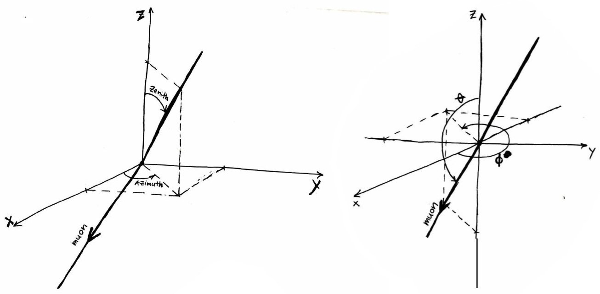

===========
I3Direction
===========
As the name says, the I3Direction class stores a direction, usually the direction of motion (or momentum) of a particle like a muon. The direction may be expressed in a standard polar coordinate system with the z-axis pointing up, θ as the polar angle w.r.t. the z-axis, and φ as the angle corresponding to a positive rotation around the z-axis, measured from the x-axis, as illustrated in the bottom figure below. For an incoming particle, the coordinates on the celestial sphere corresponding to the opposite direction, i.e. the (apparent) origin of the particle, are
::
   
 Zenith = π - θ
 Azimuth = (π + φ) mod 2π

This picture, stolen from Dusan's Homepage, which illustrates θ, φ, zenith, and azimuth for a downgoing muon:

   
   The IceTray Coordinates by Dusan Turcan. Oil on canvas, around 2006.

The I3Direction class also provides components along the cartesian coordinate axes (x,y,z) (see also `The IceCube detector coordinate system <https://wiki.icecube.wisc.edu/index.php/Coordinate_system>`_. It is very important to understand that the Zenith and Azimuth are the direction the particle is coming from, but (x,y,z) are the direction the particle is going.

See the python API documentation for :py:class:`icecube.dataclasses.I3Direction`.

Examples
========

Assume a muon is going straight down, i.e. it is coming from straight above at the surface at the South Pole (i.e. x=0,y=0,z=-1):
::
   
   >>> dir = icecube.dataclasses.I3Direction(0,0,-1)
   >>> dir.x
   1.2246063538223773e-16 # Because I3Direction stores the direction as zenith and azimuth angles internally, this is basically 0!
   >>> dir.y
   0.0
   >>> dir.z
   -1.0
   >>> dir.zenith
   0.0
   >>> dir.azimuth # Note that azimuth is not defined for a straight down- or up-going particle It can be 0-2pi!
   3.141592653589793
   >>> dir.theta
   3.141592653589793 # This is pi!
   >>> dir.phi # Note that phi is not defined for a straight down- or up-going particle It can be 0-2pi!
   0.0
 
Assume a muon is traveling along the x-axis in the xy-plane coming from negative x-values and going to positive x-values (i.e. x=1,y=0,z=0):
::
   
   >>> dir = icecube.dataclasses.I3Direction(1,0,0)
   >>> dir.x
   1.0
   >>> dir.y
   0.0
   >>> dir.z
   6.123031769111886e-17 # Because I3Direction stores the direction as zenith and azimuth angles internally, this is basically 0!
   >>> dir.zenith
   1.5707963267948966 # This is pi/2!
   >>> dir.azimuth
   3.141592653589793 # This is pi!
   >>> dir.theta
   1.5707963267948966 # This is pi/2!
   >>> dir.phi
   0.0
   

