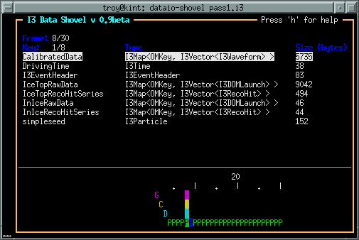

Dataio Viewers
==============

dataio-shovel
-------------

The dataio-shovel is a .i3 file browser utility. It has interactive
help and can be handy to identify what is inside a .i3 file. Try it
out. Here comes the screenshot:

The bottom part of the display shows a tape-like representation of the
icecube data stream. The G, C, D, Q, and P represent Geometry,
Calibration, DetectorStatus, DAQ, and Physics, respectively. The bar in the
middle is the location of the tape read head. On the top half are what
is currently under the read head: a 'frame'. Each row is one data
item. On the left is the 'key' the object is stored under, in the
middle is the type of the object (with typedefs stripped away), on the
right is the on-disk size of the object in bytes.

The up-down arrows select frame items and the 'x' key will display
that item in XML. The 'c' key will show the configuration of the tray
that generated the datafile, including all module parameters, svn
information, time of run, hostname, compiler and root versions, and
operating system type. Full help is available in the shovel itself.

dataio-pyshovel
---------------

The dataio-pyshovel is a rewrite of dataio-shovel in python instead
of C++.  This allows I3RecoPulseMapMasks and similar objects to be
translated to human-readible things, and enables the 'o' or 'enter'
keys to provide a pretty printout of objects.

The other headline feature is the ability to drop into ipython while
keeping the frame and its frame objects as local variables.  This
allows very easy in-depth examination of frame objects.

Other minor changes include only reading partially through a file and
lazy loading the rest to allow prompt viewing of the first few frames.

