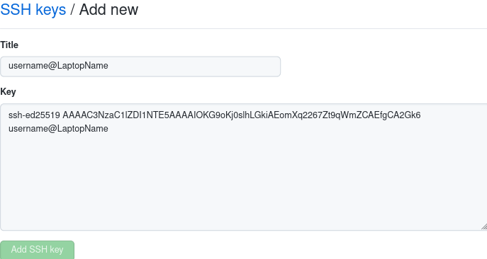

Connecting to Github from Cobalts
=================================

This page describes how to connect to github repositories from the cobalts.
The primary way that github syncs with git repositories is through ssh which is the same 
method used to connect to the cobalts.
The easiest way to connect to github from the cobalts is to create a public/private key pair
on your laptop and then use that same key pair to connect to both the cobalts and github using
an ssh-agent.

Generating a key pair on your laptop
------------------------------------

Start on you laptop and make sure you have an ssh-agent running.
On MacOS an agent should already be running.
On Linux, most desktop environments will automatically start an agent. 
To verify an agent is running on your laptop, you can run the following command:

.. code-block:: bash

    $ echo $SSH_AGENT_PID $SSH_AUTH_SOCK 

If an agent is running, you should get output that looks like this:

::

    263673 /tmp/ssh-XXXXXX4GogBF/agent.263672

If you do not see any output for this command, stop and install an ssh agent.
Installing an agent is beyond the scope of this document, please consult the documentation
for your linux distribution and/or desktop environment.

Once you have confirmed that you have an ssh-agent running, the next step is to generate a key. 
On your laptop run:

.. code-block:: bash

    $ ssh-keygen -t ed25519 -C "<YourUsername>@<YourLaptopName>"

The ``-C`` option is a comment for your own record keeping, what you type there will 
not effect the functionality of your key. It is tradition to write your user name and
the hostname of your laptop here. This helps you keep track of which key is which 
if you have multiple keys generated from multiple devices.

You will be prompted to enter the filename for your private key, the default is fine.
You will also be prompted to enter a passphrase. DO NOT LEAVE THIS EMPTY.
Please enter a secure passphrase, something that will be hard for someone to guess.
The output should look like this:

:: 

    Generating public/private ed25519 key pair.
    Enter file in which to save the key (/home/kjm/.ssh/id_ed25519): 
    Enter passphrase (empty for no passphrase): 
    Enter same passphrase again: 
    Your identification has been saved in /home/kjm/.ssh/id_ed25519
    Your public key has been saved in /home/kjm/.ssh/id_ed25519.pub
    The key fingerprint is:
    SHA256:qgeTLaHoFn9xH5uyLu5IpI7rvV1SUtkjQZZSXrgPo9E username@LaptopName
    The key's randomart image is:
    +--[ED25519 256]--+
    |      o=o.       |
    |     .oo=        |
    |      o=.o       |
    |    ...E. .      |
    | . o =o.S        |
    |..+ =o+o o       |
    |..o. =+.. +      |
    |ooo.o++. +       |
    |=+ +*=ooo        |
    +----[SHA256]-----+

Now lest take a look at your ``.ssh`` directory:

.. code-block:: bash

    $ ls -l ~/.ssh

you should see that ``ssh-keygen`` created two files: 

::

    .rw------- 444 kjm 28 Jun 13:24 id_ed25519
    .rw-r--r--  91 kjm 28 Jun 13:24 id_ed25519.pub

``id_ed25519`` is your private key, do not ever share the contents of this file with
anyone and do not ever copy this file from one device to another. 
``id_ed25519.pub`` is the public key, this is what you will be sharing with servers that 
you want to connect to.

Logging to the cobalts with the key pair
----------------------------------------

Now that we have a key pair we need to transfer the public key to pub so that we
can ssh into pub and the cobalts. On your laptop run

.. code-block:: bash

    $ ssh-copy-id -i ~/.ssh/id_ed25519.pub <yourusername>@pub.icecube.wisc.edu

In order to copy your public key to pub you will need your IceCube LDAP password and you
will be prompted for this.

Now you should be able to login to pub with your key pair instead of your password. Try running

.. code-block:: bash

    $ssh <yourusername>@pub.icecube.wisc.edu

If you are prompted for a passphrase, then your key pair is working.
If you are instead prompted for a password, that means that something is wrong with your key pair,
this needs to be fixed before continuing.

At this point every time you log into pub you will be prompted for your passphrase,
this can get annoying, so let's add our key to the agent when it is used.
Edit your  ``~/.ssh/config`` and add the following line:

::

    AddKeysToAgent yes

In order for this to work you need to set the permissions correctly on the config file

.. code-block:: bash

    $ chmod 600 .ssh/config

Now you will be prompted to enter your passphrase the first time you try to log into pub,
but all subsequent logins will not need the passphrase. 

Now we can login to pub with our key pair, but to get any actual work done we need to login
to the cobalts. However, if we try to login to the cobalts from pub at this point we will get a password
prompt. If we enable agent forwarding than the key in the agent on our laptop can also be used to when 
we login to cobalt from pub.

Logout of pub and edit ``~/.ssh/config`` on your laptop. Add the following line:

::

    ForwardAgent yes

With this line on your laptop's ssh config you should be able first login to pub and then login
to cobalts without a passphrase prompt. This also means that your key pair is also available
for use with github on cobalts.

Now in order to have your key forwarded from pub to cobalt you need to enable forwarding on pub.
On pub edit ``~/.ssh/config`` and add the following line:

::

    ForwardAgent yes

and once again set the permissions on your ssh config:

.. code-block:: bash

   pub$ chmod 700 .ssh/config

Connecting to github with the key pair
--------------------------------------

Now we need to let github know about the public key so we can access our repositories.
Go to your github's setting's keys page: https://github.com/settings/keys.
Or click on the menu on the top right corner of gitgub and go to ``settings`` -> ``SSH and GPG keys``.

Click on the green button that says ``New SSH key``. You should see two text boxes:

In ``Title`` you can type whatever you want, most likely you will want to type
the same thing as the comment when you ran ``ssh-keygen`` above.
In the ``key`` box copy the contents of ``~/.ssh/id_ed25519.pub`` and 
press the ``Add SSH key`` button.

You should see that your key has been successfully added to github, it will look like this:

Now that github has your public key, you should be able to login to cobalt and clone icetray:

.. code-block:: bash

    laptop$ ssh <yourusernamne>@pub.icecube.wisc.edu
    pub$ ssh cobalt
    cobalt01$ git clone git@github.com:icecube/icetray.git

.. Note::

    If you want to login from more than one device repeat the instructions above
    for each device. Do **NOT** copy your private key from one device to another.

Additional Tips
---------------

For your convenance you can login directly to the cobalts by adding the following
to your ``.ssh/config``:

::

    Host pub
        HostName %h.icecube.wisc.edu
        User <YourUserName>

    Host cobalt??
        User <YourUserName>
        ProxyJump pub

You can now login directly to the cobalts from your laptop

.. code-block ::

    $ ssh cobalt01
