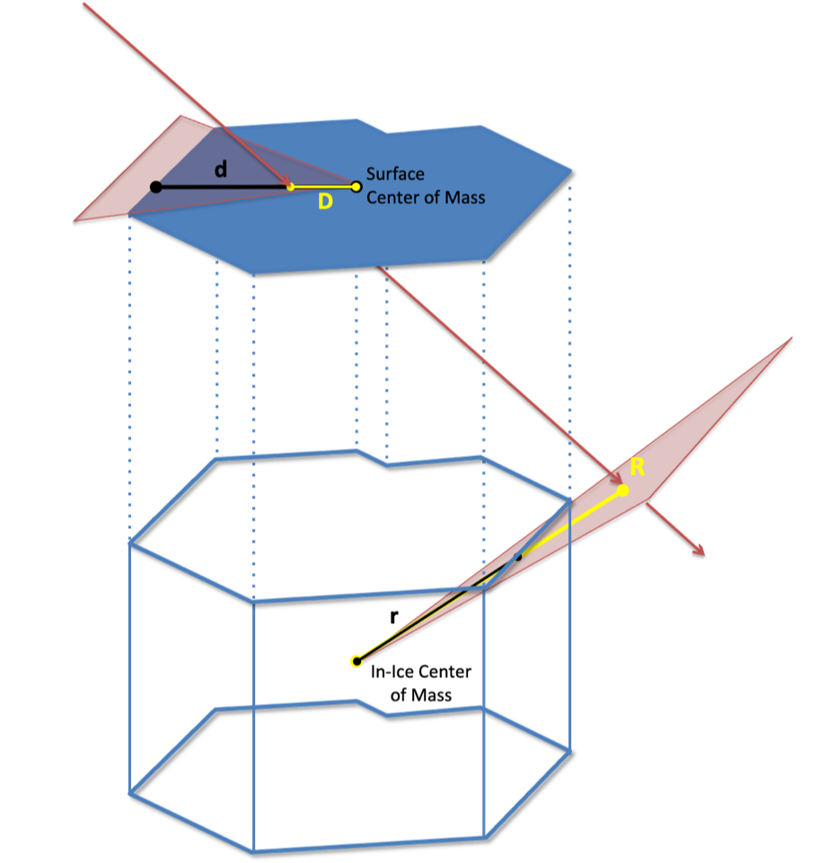
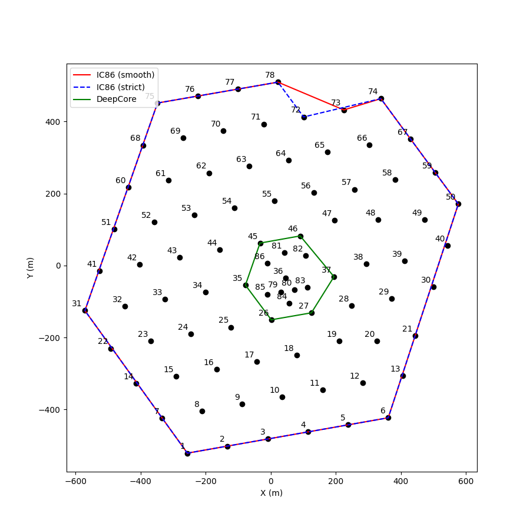
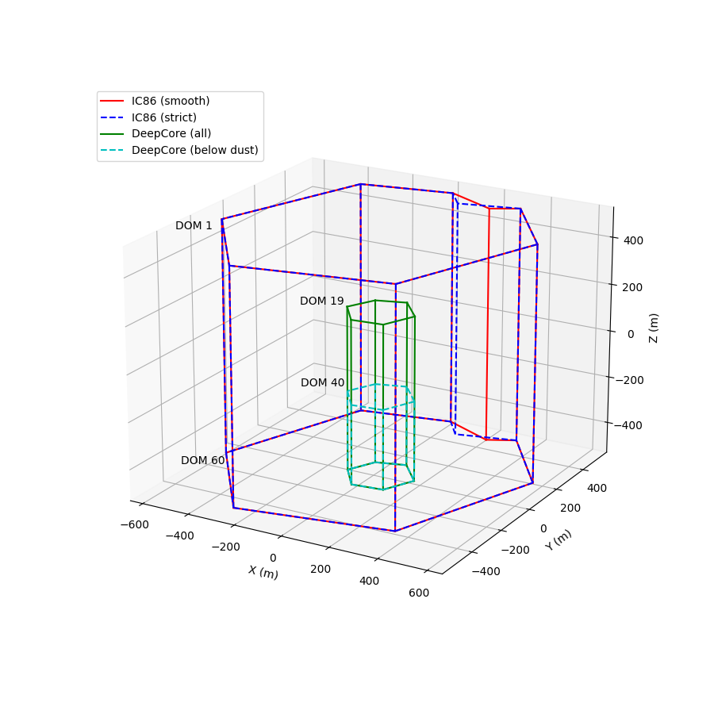
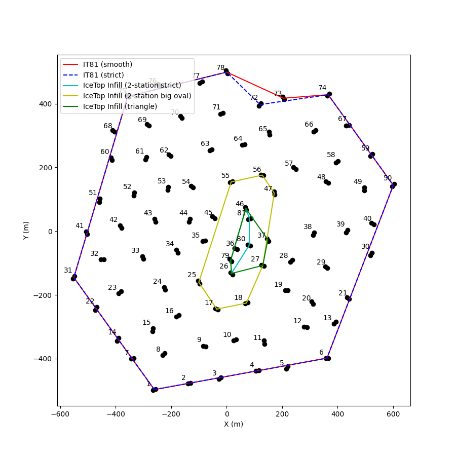

The I3ScaleCalculator: a tool for computing how contained a track is
====================================================================

:author: Katherine Rawlins (krawlins@alaska.edu)

Introduction
------------

There are times when you want to know whether a track is "contained" inside a volume (such as IceCube),
or goes through the interior of a flat area (such as the IceTop detector).  
Additionally, it would be nice to know "how contained" the track is: that is, does is just barely "skim" the edge, or does it 
go comfortably through the deep interior?  Or, if it's not contained, how far outside does it pass?

Because IceCube and IceTop are a funny shape -- approximately hexagonal, but with a weird "notch" in one corner -- 
the calculation/interpretation of this can be a little tricky. 
Indeed, this code was originally conceived back in the IC-40 and IC-59 days, 
when the IceCube's "volume" and IceTop's "area" were even funnier shapes.
The :cpp:class:`I3ScaleCalculator` is not the only way to define "containment," but it is one.

The "scale" is the amount by which you would have to scale up (or down) the detector's dimensions in order for
the track to just barely graze the edge: "D/d" or "R/r" in the graphic above.  
So if this number is 1.0, then the track is already right at the edge.
If this number is less than 1.0, then it is "contained", and the smaller the number (towards zero), the closer it
passes to the center.  If this number is greater than 1.0, then it is not contained, and the larger the number the
farther away it is passing from the edge.

So the "scale" is a similar idea to that of the "distance of closest approach", except that it's measured relative
to the dimensions of the detector -- as a fraction -- rather than in meters.  And it accounts for the funny-shaped-ness
of the detector's edges.

Usage
-----

Here's an example of how you can compute the scaling factor (or "containment value") in a python script:

.. code-block::

  from phys_services import I3ScaleCalculator
  # Grab the geometry
  geo = frame["I3Geometry"]
  # Create an I3ScaleCalculator with some detector-boundary definitions: for IceCube, and for IceTop
  calc = I3ScaleCalculator(geo, I3ScaleCalculator.IC86_STRICT, I3ScaleCalculator.IT81_STRICT)
  # Specify your favorite track
  track = frame["NameOfMyFavoriteTrack"]
  # Compute the scaling factors; these will be numbers, either less than or greater than 1.0:
  volume_containment = calc.icecube_scale(track)
  area_containment = calc.icetop_scale(track)

Note that you need to specify not only the detector's I3Geometry, but also a description of how you'd like to define its "boundary."
You can let it guess one based on the number of strings in the geometry, or you can choose one of several pre-defined options (below), or 
create a custom definition.  If you leave these options blank, it will guess.

IceCube (volume) boundary options:
&&&&&&&&&&&&&&&&&&&&&&&&&&&&&&&&&&

.. list-table::
  :widths: 4 20
  :header-rows: 0

  * - IC_EMPTY             
    - Don't load any IceCube detector, we won't be doing any volume-scaling calculations (only area).
  * - IC_GUESS                            
    - Please guess for me, based on the number of strings in the I3Geometry.  At present, either IC79_SMOOTH, or IC86_SMOOTH.
  * - IC86_STRICT                       
    - The boundary of the IC86 detector as shown by the blue line in the figure below.
  * - IC86_SMOOTH                       
    - A slightly different version of this boundary, in which the "notch" in the northeast corner is smoothed over a little (by one string).
  * - IC79_STRICT                       
    - Similar to IC86_STRICT, except that the southwest border goes straght from string 41 to string 2 (omitting those 5 strings on the edge not present in IC79).
  * - IC79_SMOOTH                       
    - Similar again, except for the slightly different treatment of the northeast "notch".
  * - DEEPCORE_ALL                      
    - The hexagonal boundary of "DeepCore Fiducial" from :wiki:`DeepCore`, starting vertically from the height of the top DOM's in DeepCore.
  * - DEEPCORE_BELOWDUST                
    - The same as DEEPCORE_ALL, except the height starts at the DeepCore DOM's below the dust layer.
  * - IC_CUSTOM                         
    - I, the user, will be supplying my own list of strings to use as the boundary.

|pic1| |pic2|

IceTop (area) boundary options:
&&&&&&&&&&&&&&&&&&&&&&&&&&&&&&&

.. list-table::
  :widths: 4 20
  :header-rows: 0

  * - IT_EMPTY 
    - Don't load any IceTop detector, we won't be doing any area-scaling calculations (only volume).
  * - IT_GUESS 
    - Please guess for me, based on the number of stations in the I3Geometry.stationgeo.  At present, either IT73_SMOOTH, or IT81_SMOOTH.
  * - IT81_STRICT 
    - The boundary of the IT81 detector as shown by the blue line in the figure below.
  * - IT81_SMOOTH 
    - A slightly different version of this boundary, in which the "notch" in the northeast corner is smoothed over a little (by one string).
  * - IT73_STRICT
    - Similar to IT81_STRICT, except that the southwest border goes straght from string 41 to string 2 (omitting those 5 stations on the edge not present in IC73).
  * - IT73_SMOOTH 
    - Similar again, except for the slightly different treatment of the northeast "notch".
  * - IT_INFILL_STA2_STRICT (experimental) 
    - A boundary defined by the six stations that participate in the IceTop 2-station Trigger. Since it's so long and skinny, may expand or contract to some rather funny shapes.
  * - IT_INFILL_STA2_BIGOVAL (experimental)  
    - A boundary defined by the stations "one layer out" from the eight of the 2-station Trigger.  When this one expands and shrinks, it will form less extreme shapes.
  * - IT_INFILL_TRIANGLE (experimental)  
    - Similar to the 2-station Trigger, but additionally including stations 27 and 37, which collectively form a broader "Infill region" of densely-packed stations.
  * - IT_CUSTOM
    - I, the user, will be supplying my own list of stations to use as the boundary.

What if I want to define a different boundary?
----------------------------------------------
If none of the pre-programmed detectors are to your liking, you can create your own.
Use "IC_CUSTOM" (or "IT_CUSTOM") as the configuration, and then follow with a list (a std::vector) of integers
representing the string (or station) numbers that you'd like to use to define your boundary.  
You'll have to do this if you're working with old data such as from IC59 or before, or with a future detector such as Gen2.
So for instance, this will define a custom boundary for IC-40, and also IT-40 for IceTop:

.. code-block::

  # Create an I3ScaleCalculator with custom boundaries for both IceCube and IceTop:
  ic40boundary = [21,50,74,73,78,75,60,52,53,44,46,38]
  it40boundary = [21,50,74,73,78,75,60,52,53,44,46,38] # they were the same, that year -- but you can make them each anything you like
  calc = I3ScaleCalculator(geo, I3ScaleCalculator.IC_CUSTOM, I3ScaleCalculator.IT_CUSTOM, ic40boundary, it40boundary)

Note: these boundary strings must be listed "in counter-clockwise order" around the boundary.

There are additionally two more optional arguments, specifying which DOM's along the boundary strings to use as the top 
and the bottom of your detector.
The defaults are 1 and 60 respectively, except for the two DEEPCORE options (Details in footnote [#]_).  
If you're using an IC_CUSTOM boundary, and also want your detector to have a custom height, 
you can specify the top and bottom DOM number with these two additional arguments.
The IceTop z-coordinate is fixed at 1950.0 meters.

What if I want to customize this further, by specifying a set of coordinates rather than string/station numbers?
----------------------------------------------------------------------------------------------------------------
In that case, you probably want to use the actual code which performs the calculation, which is
located in I3Cuts.cxx, and takes actual coordinates (not string/station numbers) as input. 
The :cpp:class:`I3ScaleCalculator` is really just a wrapper for defining commonly-used boundaries and then calling the functions from :cpp:type:`I3Cuts`.
The functions are called :cpp:func:`I3Cuts::ContainmentAreaSize` (for areas) and :cpp:func:`I3Cuts::ContainmentVolumeSize` (for volumes).  
There are pybindings for both these functions.  

At the moment, the calculation is limited to polygons or polyhedra specified by vertices in space:
(x,y) plus a common (z_top) and (z_bottom) 
for a prism-shaped volume detector such as IceCube, or (x,y) plus one (z) level for an area detector such as IceTop.  
The code computes the "Center of Mass" of the shape
(because detectors are not necessarily centered on (0,0) in a coordinate system; see IC-40 for a good example of this).
The mathematics of detector "expansion/contraction" are envisioned as the vertices moving away or toward the Center of Mass.

There is also a :cpp:func:`I3Cuts::CylinderSize` function, which computes this for a cylinder shape whose dimensions (radius and height)
you specify as input.  This code dates back to the AMANDA days, and is derived in Kath's thesis!

To-Do List
----------
* Add some defaults/options that would be useful for Gen2, Upgrade, and SurfaceArray.
* For IceTop area, make the Z coordinate height adjustable by user parameter (at the moment, it's hard-coded to 1950 meters).

.. [#] In both the DEEPCORE options, six normal strings define its boundary, but we want the *height* of the 
   detector boundary to be different from the default.
   DEEPCORE_ALL sets DOM 19 as the top, since DOM 19 on a "normal" string is at approximately the depth of the top of DeepCore (z ~ 190 meters).  
   DEEPCORE_BELOWDUST sets DOM 40 as the top, since DOM 40 on a "normal" string is at about the depth of where DeepCore resumes 
   below the dust layer (z ~ -160 meters).
   Both set DOM 60 as the bottom.

