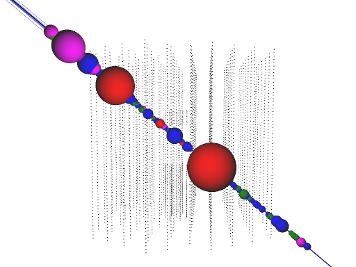

Artist Guide
============

Some artists are complex and have many options. These are explained here.

Particles
---------

Visualizes individual or collections of I3Particles.

.. _Atmospheric Muon: http://inspirehep.net/record/1379945

.. _PROPOSAL: http://inspirehep.net/record/1245588

color by type
	*For simulated events only.*
	Display discrete muon energy losses by type. The color scheme is defined as
	**red**: bremsstrahlung, **green**: delta-rays, **blue**: electron pairs, **magenta**: hadron photoproduction. For more information see the `Atmospheric Muon`_ and `PROPOSAL`_ papers.
show light fronts
	Visualizes energy losses as expanding light fronts. The visualization is based on a simple light front model and should not be regarded as a physically accurate representation.
blue light fronts
	Visualize light fronts (see previous option) in *Cherenkov blue*, otherwise use the color from the time line.
Cherenkov cone size
	Draw a Cherenkov cone.
incoming/outgoing
	For tracks that are stopping, starting, or contained, draw dashed extensions in the incoming and/or outgoing direction.
labels
	Draw labels that show the particle energy. They are only shown if the camera is very close to the particle.
min. energy [track]
	Minimum energy (in GeV) for simulated and reconstructed tracks. Increasing the value may help when displaying very energetic simulated events that take a long time to render, or to enhance high-energy features.
min. energy [cascade]
	Same as ``min. energy [track]``, but for cascades.

IceTopViewer
------------

The IceTopViewer is a special artist which adds a new view to Steamshovel instead of adding object to the 3D scene. When it is added, the previous view (usually the 3D view) is replaced by a 2D top view on IceTop, a view of the lateral density function (LDF), and the arrival times of signals relative to a plane shower front.

Since the IceTopViewer adds an alternative view intead of an object to the 3D view, there is no checkbox to hide/show it. The ``Window`` menu is used to switch between views.

Displays
^^^^^^^^
Top view
	The left plot presents a top view on the IceTop array. Tanks without signal appear as gray dots. Tanks with signal appear as a half-circe, colored according to the timeline and scaled as a function of the signal charge. 

	If an I3Particle (see setting ``particle``) is selected in the artist settings, also shown are the shower core (dot), shower direction (arrow), and intersection between shower front plane and ground plane (dashed line)

LDF view
	The top right plot presents a lateral view of the shower. It remains empty until an I3Particle is selected (see setting ``particle``). Shown are recorded signals versus lateral distance to the shower axis, multiplied by a sign that is positive for arrival times earlier than the core time and negative otherwise. If the selected I3Particle in the settings has an associated Params object, also the fitted LDF is shown.

Time view
	Top bottom right plot presents the arrival times relative to the ideal shower front. It remains empty unless an I3Particle is selected (see setting ``particle``). Shown are recorded arrival times subtracted from the ideal shower front time at the position of the station versus lateral distance to the shower axis. The sign convention is the same in the LDF view.

Waveform view
	If the user selects raw data to the displayed by the viewer (see setting ``time trace``), and additional plot shows up on the bottom left.

	It shows the recorded ATWD waveforms, and possibly the FADC waveform (see setting ``show FADC``). The overlapping ATWD channels are displayed in different colors, according to the compact legend on top of the plot. High gain and low gain are shown on the positive/negative y-axis, respectively. A colored dot represents the arrival time stored in the corresponding I3RecoPulse for that tank.

Interactivity
^^^^^^^^^^^^^
Zoom
	The user may zoom into all plots, by dragging a rectangle with the mouse over the area of interest. The mouse wheel is used to zoom out.

Selecting tanks
	Any tank in any plot can be clicked. This draws a small rectangle around the tank in all views, so the corresponding points stand out above the rest.  Additional text information about the tank is also shown.

	If the waveform view is visible (see setting ``time trace``), clicking on a tank also shows its waveform data.

Settings
^^^^^^^^
particle
	Select the particle that represents the shower axis.
time trace
	Select waveform data for the event. Adds an additional waveform view. To hide this view, select the empty entry in the combobox.
SLCs
	Select a container with SLC signals, to be shown in addition to HLC signals.
show no-hits
	Adds markers for tanks without signals in the LDF view.
show FADC
	Show the FADC trace in the waveform view.
show legends
	Show text with useful data about the event in the corners of the plots.
log-radius
	Draw points in the LDF view and time view versus ``log10(abs(lateral distance))``.
marker-size
	Size of markers in LDF and time view.
scale & power
    Affects how charge is converted into radius for the semi-circles in the top view.
