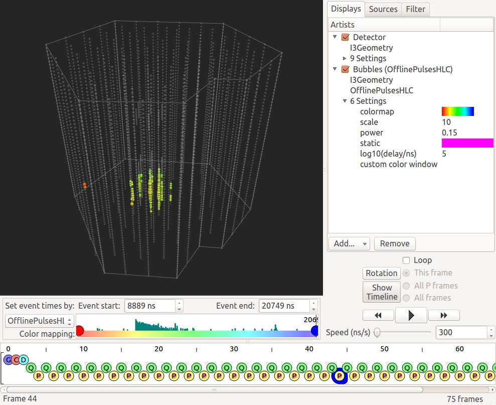
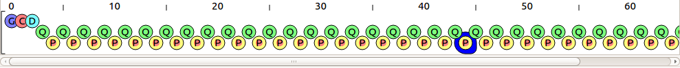
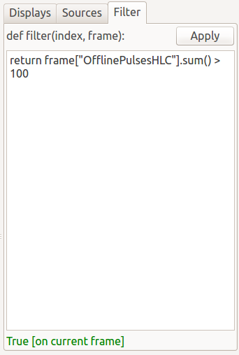
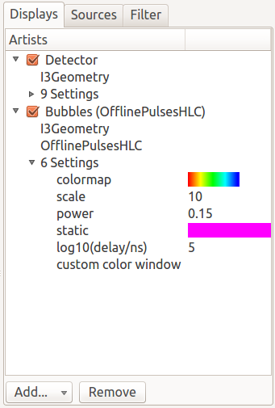
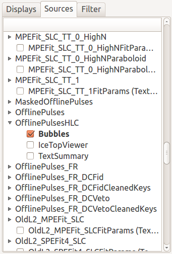
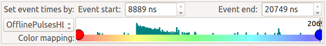
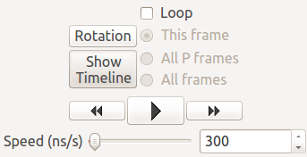
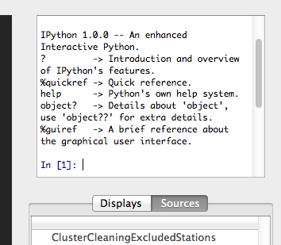

Basic Usage
===========

This is a guide to the basic features and user interface of Steamshovel, the IceCube
event and data viewer.

Opening/closing files
---------------------

Use the ``Open file...`` option from the File menu to choose data files to load.

Steamshovel can load standard ``.i3`` data files as well as their compressed forms
(usually ``.i3.gz`` or ``.i3.bz2`` or ``.i3.zst``).  Multiple files may be opened. Frame contents propagate to
subsequent files as though the group of files had been processed by an ``I3Module``.
It is common to open two file: first a GCD file specifying the detector geometry and status,
and then an events file with physics data.

You may also close either all open files or the last file in the file chain (may be repeated). If you close the last file and the remaining sequence has more than just a few frames, you may experience a noticable pause while Steamshovel is updating some internal data structures.

There is also an option to reload all opened files, useful to display a change after file contents were updated by another process.

Using sessions
--------------

The ``Sessions`` menu allows to set up the 3D view for a particular visualization task.
A session consists of a set of displays that are added to the view and their configuration, the
frame filter settings, and the range setting in the timeline widget. You may pick a standard
session supplied with Steamshovel from the ``Standard Sessions`` submenu, or load a session that
was saved previously with ``Open session``.

Sessions can be customized by adding, removing, or configuring displays. This is explained in
section `Adding new displays` and those that follow. Setting frame filters is explained in
section `Using frame filters`. Customized sessions can be saved in a file via ``Save session``.
``Clear session`` removes all displays and resets all configurations to provide a fresh start.

Steamshovel remembers the ten most recently used sessions and displays them at the top of
the menu. This makes frequent switching between sessions convenient, e.g. you may have one
for simulated events and one for real events.

Navigating frames
-----------------

Steamshovel shows a file's IceTray data streams in the bottom of the window on an
interactive "tape" display.

To select a frame to view, click on its token: a blue highlight will surround the currently
selected frame. Frames can also be navigated using the arrow keys. Frames are put into
different lines, all Q frames are on the middle line, all P frames on the lowest line,
for example. To jump to the next/previous frame in the same line, use left and right.
To switch between lines, use up and down. To ignore lines and just go to the next/previous
frame in the sequence, hold the shift key and press left/right.

Reading previous frames will not work (a read cross will appear), if the source only offers
incremental reading and the frame was dropped from the frame cache.

Steamshovel uses a frame cache for previously visited frames. In case of an incremental source, such as a pipe, steamshovel also read a few frames ahead of the current position and add those to the cache. Since one cannot restart an incremental source, only cached frames are accessible in that case. How many frames are kept in the cache can be set in the configuration (Unix: menu ``Windows`` -> ``Configuration``; Mac: menu ``steamshovel`` -> ``Preferences``).

The tape view can be hidden by dragging the splitter control separating it from the window
downwards.

Using the frame filter
----------------------

Steamshovel has tab called `Filter` on the right hand side. It has a text input field and an ``Apply`` button. 

You may use this to develop and apply frame filters. The filters are normal Python functions which return an object that is convertible into a boolean. The two arguments of the filter function are ``index``, the position of the frame in the unfiltered sequence, and the current ``frame``.

To help you write a filter function, the text input field has a footer that shows what happens if the filter is applied to the current frame as you type, including the exceptions raised by it. By browsing through several frames in your file, you can check whether your filter correctly returns ``True`` and ``False`` in the appropriate cases. If the filter raises an exception for given a frame, it acts like ``False`` was returned.

Some examples::

    # skip first 100 frames, then only select Physics frames
    def filter(index, frame):
        return index >= 100 and frame.Stop == I3Frame.Physics

    # only frames with more than 100 entries in I3RecoPulseSeriesMapMask "SomeMask"
    # and skip frames which do not have this key
    def filter(index, frame):
        return frame["SomeMask"].sum() > 100

    # only frames which contain a key of type I3Particle
    def filter(index, frame):
        for k in frame.keys():
            if "I3Particle" == frame.type_name(k):
                return True
        return False

    # ... the same filter as a one-liner  
    def filter(index, frame):
        return "I3Particle" in (frame.type_name(k) for k in frame.keys())

To finally apply the filter to all frames and get the selection that passes, click on ``Apply``.

Filters are stored as part of the current session, and automatically applied the next time you re-open that session. To remove the filter, clear the text field and click ``Apply`` again.

Note: Filters can be very useful, but cause delays when you open a new file. If a filter is active, steamshovel has to read the complete file first before the filter can be applied. If the file is large, it may take a while before you can browse the first frames.

Saving frames
-------------

You might want to save selected frames in a file, for example, to send them to a colleague (also very convenient if you want to report a steamshovel bug ;)).  You can do that simply by clicking on ``Save Frame...`` in the ``File`` menu.  A dialog appears which allows you to pick the file name and which frames to save.

The field ``Frame indices to save`` allows you to select the frame indices that you want to save.  If you specify nothing, the current frame is saved.  You can specify individual frame indices (separated by space or comma) or ranges (using the syntax ``a-b``). Here is a valid combined example: ``0 3 4 10-20 15-20 31``.

Because of frame mixing, the content of most frames relies on the presence of other frames (P frames need Q frames, Q frames needs G frames, etc.). If the option ``Save parents`` is checked, those frames are automatically included in the file.

Alternative views
-----------------

The ``Window`` menu can be used to switch the main display of Steamshovel between the primary
3D event view and other views.  Also available is a spreadsheet view, which gives an overview of the data objects in the currently selected frame.  This view is comparable to the output of a console tool like ``dataio-pyshovel``.

Other views are added to the menu if the corresponding WidgetArtists are added in the ``Displays`` tab. Currently, the only artist that uses this feature is the ``IceTopViewer``.  The 3D view is the focus of the rest of this document.

Mouse control in the 3D view
----------------------------

Left-click and drag to rotate the camera.  Shift-click and drag to pan the camera.  Use the scroll
wheel or zoom gesture to zoom the camera in and out.  If no wheel is available, the plus and
minus keys can also be used for camera zoom.

Visible DOMs can be selected by clicking on them with the mouse.  Shift-click to select multiple
DOMs.  Shift-click to unselect a selected DOM.  Some displays, such as ``Waveform``,
respond to the currently selected DOMs.

Overlay displays, including text, pictures, and graphs, can be moved by clicking and dragging.
In addition, some overlays can be resized: do this by right-clicking on them, or (on systems
without a right mouse button) clicking while holding the Control key.  Overlays that cannot
be resized this way, such as text labels, can often by resized by adjusting the appropriate
settings in the Displays tab of the window sidebar.

Adding new displays
-------------------

The sidebar on the right hand side of the Steamshovel window is the main control for adding, removing,
and adjusting the data displayed in the 3D view.  To add new visualizations, there are two approaches,
which are divided according to the two tabs in the sidebar.

The ``Displays`` tab shows the currently visible displays.  To add a new display from this tab, click the ``Add...`` button and select a display from the list. The most common IceCube displays are ``Detector``, ``Bubbles``, and ``Particles``.

If the chosen display requires some input data, you will need to select keys for it.  Open the new display's disclosure triangle, and click on ``Click to select...`` to choose each key. If the ``Click to select...`` list is empty, no valid data is available in the currently selected frame.

A quicker way to add new visualizations is the ``Sources`` tab.  This shows a list of all the
I3FrameObjects in the currently selected frame and any displays that can be created for this.
This makes it easy to quickly add several displays from the keys you have.

Changing displays
-----------------

Most displays have settings that can be changed to vary their appearance.  Settings can be changed
via the ``Displays`` tab on the sidebar.  Open the disclosure triangles for the display you want to change
to find its settings; these can generally by edited by clicking on them.

Disabling and removing displays
-------------------------------

In both the ``Displays`` and the ``Sources`` tabs, displays have check boxes that can be used to quickly enable and disable them.  A disabled display is not drawn, but it retains its settings.

To completely delete a display, select it from the ``Displays`` tab and click the ``Remove`` button or press the ``Delete`` key.  Displays cannot be deleted from within the ``Sources`` tab.

Controlling time
----------------

The Steamshovel timeline widget allows you to control the currently visible time in the event.

The *current time* is always displayed with a black vertical bar and a numeric label.  This is the
event time (measured in nanoseconds) that is currently being displayed in the 3D view.  Pressing play
(see the animation section) will set this time to update automatically.  The time can also be set
by clicking (and optionally dragging) in the time graph.

The *event start* and *event end* numbers show the mimimum and maximum times visible on the time graph.
These can be set in various ways.  The ``Set event times by:`` selector allows you to set times from
various objects in the currently selected frame.  The time extents can also be chosen from a default,
or adjusted manually.

The red and blue circles control the scaling of color maps within the event view.  They can be changed
by clicking and dragging.

The timeline can be hidden or shown via the ``Show timeline`` button in the animation control panel.

Controlling animation
---------------------

Behold the animation control panel:

The three buttons in the center are rewind, play/pause, and fast-forward buttons, which control the action of the current time on the timeline.  The speed slider controls how fast the event is played, in terms of a ratio of nanoseconds passed in the event to seconds of real time passed.

Note: The speed is only accurate, if your computer is able to render 30 frames per second, otherwise the actual playing speed will be slower. You can check the current frame rate by clicking into the 3D view and pressing ``0`` on the keyboard. The rate will then be displayed in the status bar after a short warm-up phase.

Check the ``Looping`` box to automatically continue animation when the end of the timeline is reached. A single frame may be looped over, or frames of the same type as the current frame, or all frames.

Click the ``Rotation`` button to automatically rotate the detector in the 3D window; this is often a nice effect to spice up animations.

Background color and camera settings
------------------------------------

In the ``View`` menu, the user can set the background color of the 3D view.  This menu also allows
the user to enable or disable the perspective 3D view.  When perspective is disabled, an orthographic
camera is used, and no perspective / depth effects will be visible.  This can be useful for making
schematic diagrams or axis-aligned screenshots.  There are also three options to align the camera with each axis for this purpose.

The ``View`` menu also provides a ``Focus on...`` submenu, providing choices of locations to center the camera in the 3D view.  If a frame is selected, this menu will be populated with locations associated with objects in the frame.

You can also reset the camera with ``Reset camera``, or lock the camera in the current position to preventing accidental movement with ``Lock camera``.

Full screen and TV mode
-----------------------

The ``Window`` menu can be used to enable two special modes: full screen and tv mode. In full screen mode, the steamshovel window expands to fill the screen, with all controls remaining visible.  In TV mode, the 3D view alone expands to fill the view.  Both modes are exited by pressing Escape.

Secondary windows
-----------------

The option ``New window`` in the ``Window`` menu opens a secondary main window, showing the same frame. The secondary window always remains on top of the main window. This feature allows users to simultaneously display different views of the same event. One use case is to show IceTop in the 2D IceTopViewer and the deep detector in the standard 3D view.

Screenshots and movies
----------------------

Dialogs for creating screenshots and movies are available from the ``Window`` menu.

For further info about creating high-resolution output from these dialogs,
see the :doc:`steamshovel output guide <outputguide>`.

Python prompt
-------------

Steamshovel can be extensively scripted through the Python prompt, which can be shown/hidden by pressing Ctrl+T or by checking/unchecking ``Show Python prompt`` in the ``Window`` menu.

Note: This requires both IPython, PyQt5, and possibly qtconsole (if you have IPython 4 or newer) to be installed on the machine, which are optional dependencies of Steamshovel. If you do not have these, the option in the menu is disabled. You can still interact with Steamshovel if you run it from a terminal. It will start an IPython or vanilla Python interpreter linked to steamshovel, whatever is available. This does not work if you use the Steamshovel app on the Mac.

Documentation on the scripting system is available in the :doc:`steamshovel scripting guide <scripting>`.

Setting preferences
-------------------

Most settings in Steamshovel are stored as part of the session, e.g. artist, camera, or filter settings. Other options affect steamshovel as a whole and are independent of the session. These can be changed in the configuration dialog (Linux: menu ``Windows`` -> ``Configuration``, Mac: menu ``steamshovel`` -> ``Preferences``).

The dialog allows one to set the default font and size used in Steamshovel.

Two other settings affect performance. You may choose how many frames should be kept in memory (previously visited and next in the sequence), and if there are keys that should not be read from files at all. A good key to ignore is ``I3Calibration``. The I3Calibration object is not used by most artists, but takes quite a few seconds to load from disk.

Finally, there is a convenience feature that allows the user to define a default I3Geometry object. The I3Geometry defined there is automatically inserted into frame sequences that do not contain an I3Geometry.
