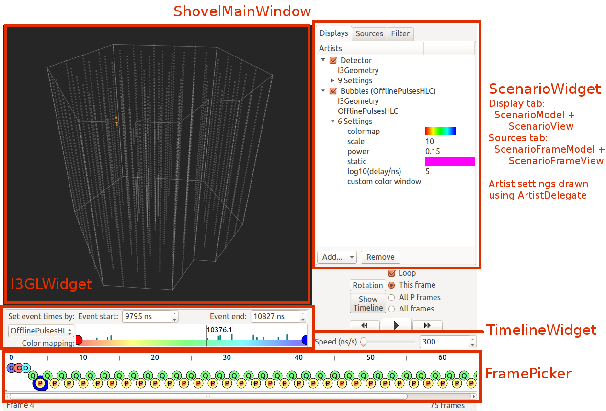

Hacking Guide (for deep changes to Steamshovel)
===============================================

Basic program layout
--------------------

::

  /private
      /scripting -- Utilities for C++ / Python interaction
      /shovelart -- The steamshovel graphics library
      /shovelio -- Steamshovel file handling library
      /steamshovel -- GUI and program files
      /ui -- Qt .ui files defining GUI widget layouts; view using Qt Designer
  /public
      /shovelio -- "public" shovelio headers; steamshovel is the only client
  /python
      /artists -- Steamshovel's default Python artists
      /embed -- Python utilities for embedding Python in a C++ app
      /util -- Various utilities, mostly supporting GUI features
  /resources
      /shader -- Steamshovel graphics shaders
      /Steamshovelapp -- Support files for standalone Steamshovel.app binary on OSX

Getting oriented: Support systems
---------------------------------

QT Signals and Slots
^^^^^^^^^^^^^^^^^^^^

Take some time to read about the Qt signal and slot system.  When a signal is
emitted via Q_EMIT, various slots may be called depending on what has been
connected using QObject::connect.  Lots of important program calls happen this
way.

Note that signals and slots may be connected within the Qt Designer
application, which was used to create the GUI layouts in the private/ui
directory.  Although I have largely used explicit QObject::connect calls within
handwritten code, there are some signals and slots set up in the .ui files. Be
aware of these connections when hacking on the GUI.  Incorrect QObject::connect
calls often show up as printed runtime errors rather than compile errors.

Embedded Python
^^^^^^^^^^^^^^^

The main() function is in C++, but after parsing arguments Steamshovel
initializes Python to be used as an embedded language.  In addition,
Steamshovel will create an interactive Python interpreter to interact with the
user, in one of three ways.  By default, it tries these options in order until
one of them succeeds:

1) Try to add an ipython Qt widget in the Steamshovel program window.  The
   widget will use an "in-process" IPython kernel so its python data is shared
   with Steamshovel's main python context. This requires a sufficiently new
   version of ipython (>= 1.0) as well as the PyQt5 package.
2) Try to start an ipython prompt on stdin/stdout.  This can succeed with older
   versions of ipython.  Starting steamshovel with --console will default to
   this behavior.
3) Try to start a vanilla python prompt on stdin/stdout.  Starting steamshovel
   with --vanillaconsole will default to this behavior.
4) Give up and have no python prompt for the user.  Embedded python code within
   Steamshovel's classes will still work.  Starting steamshovel with --noconsole
   defaults to this behavior.

Note that there is also a hidden command-line option --macapp, which will
attempt to use option (1), and, upon failure, will fall back directly to option
(4).  This corresponds to the behavior of the .app version of Steamshovel
on OSX, which will never have a standard tty for stdin and stdout.

If options (2) or (3) are taken, Steamshovel will create a new thread to run
the Python REPL.  This is the only instance of explicit multithreading in
Steamshovel.

Steamshovel contains a function to run an input script as though it had been
invoked from the Steamshovel console -- whichever of the four console options
above is running.  This function is, perhaps confusingly, found in
python/embed/console_widget.py.  To make this feature work correctly, we set
the Python input hook (see python/embed/console.py) to a custom method,
explicitly *unsetting* any hooks that will be set by default from PyQt.
The right way to call this method from C++ is through scriping::executeScript().

QMeta
^^^^^

Defined in private/scripting/qmeta.* and qmeta_args.*, the QMeta subsystem
provides a lightweight automatic scripting system for Qt objects.  Its primary
feature is to expose the public slots of a Qt object as callable python
functions, and the properties of a Qt object as readable and (optionally)
writable python attributes.  Steamshovel exports the following objects through
QMeta

* app (the global SteamshovelApp instance)
* app.files (the app's FileService instance)
* window (a ShovelMainWindow instance)
* window.timeline (the window's TimelineWidget instance)
* window.gl (the window's I3GLWidget instance)
* window.movieEngine (the window's MovieEngine instance)

QMeta has proven useful for rapid prototyping of new features.  Add a new
feature as a slot of I3GLWidget, for instance, and recompile; you can now call
the slot from the embedded Python prompt, thus testing it without writing any
additional code to call it.

Classes with many slots/properties may expose a cleaner, more limited interface
by setting the Qt classinfos qmeta_scriptable_props and qmeta_scriptable_slots.
This is done in e.g. the TimelineWidget.

Multithreading
^^^^^^^^^^^^^^

As mentioned above, the only multithreading in Steamshovel comes from the
tty-based Python prompts; everything else happens in the main event-dispatching
thread.  The main burden of synchronization thus falls on code that may be
executed from the Python prompt.  QMeta handles this automatically, ensuring
that all Qt operations occur in the GUI thread, so QObjects whose public
methods are exposed this way don't need to think about synchronization.

The only other place in the code that needs to worry about this are the
shovelart Scenario pybindings, since a Scenario object is made available to
python as window.gl.scenario.  The threadSafeQInvoke() function defined in
shovelart/pybindings/Scenario.cpp handles synchronization for this purpose, and
will be a good example to draw from if more synchronization code is needed in
the future.

In order to allow the Python interaction thread (if it exists) to proceed, the
main GUI thread does *not* hold the Python GIL most of the time.  GIL
acquisition is explicit and uses the scripting::ScopedGIL RAII class.  (Note
that there is now an equivalent class in icetray/public/python/gil_holder.h,
but I have not changed the code to use this.)

The policy of not holding the GIL unless necessary creates one particularly
nasty corner case for objects belonging to a class that is extended in python
using boost::python::wrapper.  The situation is described in
scripting/pycompat.cpp, which also contains a workaround.  It is my hope that
nobody will need to touch this code.

shovelio
^^^^^^^^

The goal of shovelio is to expose a set of I3 files, possibly compressed, as a
single large buffer of I3Frames that can be navigated at will.  This feature
did not exist in dataio because compressed files could only be read
sequentially.  The correct behavior is to have each frame appear as it would
appear if being read by an I3Reader with the given set of files.

Because compressed files can only be read forward or else rewound and restarted
from the beginning, random access through them is slow.  Shovelio does a bit of
frame caching to try to alleviate this.  However, a common source of slowdown
is a user opening a large compressed file and having to wait while its length
is determined.  This is also a common source of user complaints-- "Steamshovel
loads files more slowly than glshovel"-- since older tools did not support
compressed files at all.

Basic python bindings for shovelio are given to enable easier unit testing.

It would be appropriate for shovelio to be migrated into dataio eventually.
Note that shovelio does not make use of dataio in any way-- shovelio::I3File
calls I3::open() from icetray/open.h.  The biggest work for merging shovelio
into dataio will be API design to cover all the features that are available in
both dataio and shovelio.

Style, or: Small Stuff, Not To Be Sweated
^^^^^^^^^^^^^^^^^^^^^^^^^^^^^^^^^^^^^^^^^

Steamshovel requires the explicit versions of Qt keywords over general keywords,
e.g. Q_SIGNALS and Q_SLOTS instead of SIGNALS and SLOTS.  This behavior is
enforced in cmake through -DQT_NO_KEYWORDS.

In most places I have followed the Qt convention of having class methods
member() and setMember() instead of the Icecube convention of GetMember()
and SetMember().

The C++ code uses tabs for indentation and extra space characters for
alignment.  The Python code uses four spaces for indentation.

Guided tour of shovelart
------------------------

Shovelart is both a directory full of C++ files used for steamshovel's
graphics, and a python module of the same name.

The most basic Shovelart types are vec3d (which is just a typedef of QVector3D;
see the Qt docs) and the TimeWindow from timewindow.h (which encapsulates the
state of the timeline for drawing and animation purposes).

The central class of shovelart is the Artist class.  An Artist is a unit of
visualization: given an appropriate I3Frame, an Artist creates drawable things
(SceneObjects) that can be drawn on the screen.  Artists are intended to be
easy for non-experts to write and experiment with; this is done through
subclasses an Artist in either C++ or (more usually) Python.

The client-facing API of shovelart is the Scenario class.  A Scenario is a
collection of Artists.  All editing of artists -- adding, removing, and
changing of their attributes -- happens through the methods of a Scenario
object.  The Scenario is a QObject and announces changes to its state and the
state of its artists through Qt signals.  The signals of the Scenario are the
only way GUI classes are informed of changes to Artists.

Artists do not draw directly on the screen themselves-- SceneObjects do this.
Artists create SceneObjects as part of their primary create() method.  Within
shovelart, a Scene class is used to organize SceneObjects, adding and removing
them from the visual field as artists change.  The Scene class has a lot of
important features, but it is not a client-facing class; it is fully managed by
the Scenario.

The properties of SceneObjects, such as color, size, and location, are
controlled by SceneVariants.  These are objects with values that may vary over
time as the "current visible time" (i.e. the current time selected in the
viewer) changes.

For performance and simplicity, all SceneObjects are implemented in C++.  Their
behavior can be customized in Python by creating Python SceneVariants.  This is
not commonly done, since the built-in SceneVariants are often sufficient, but
it does provide a means for more serious customization of behavior for advanced
users.  The python/artists/Tank.py class has an example of a Pythonic
SceneVariant.  Because SceneVariants are evaluated at every redraw, their
performance does matter, and creating many Python SceneVariants will reduce
program performance.  Thus they are more commonly used for experimentation.

ColorMaps are used wherever a spectrum of colors is needed to color a
SceneObject according to some parameter (usually time).  Two are defined in
C++: a basic hue-based map derived from glshovel, and a user-configurable
constant color.  Other maps are pulled in from the maps defined in matplotlib,
if it's available.  A specially customized SceneVariant<QColor> called a
TimeWindowColor maps from color maps to QColors, and this variant type is used
as the color value of most color mapped SceneObjects.

The Scenario manages two kinds of data on behalf of its Artists: their keys
(strings which refer to I3FrameObjects that the Artists take as inputs), and
their settings.  Settings are stored as Artist::Setting objects, with an
underlying boost::any that holds their data.  In theory any type may be a
setting.  However, only "known" setting types work with the GUI and python
bindings.  The type fluidity of the artist settings is a cause of some code
complexity, particularly in the python bindings (the biggest mess being in
shovelart/pybindings/Settings.cpp); again, the goal has been to make writing
new Artists in python as simple as possible for normal users.

Guided tour of GUI classes
--------------------------

The most complex systems in the GUI classes are the ScenarioModel,
ScenarioFrameModel, and ScenarioWidget.  These correspond to the sidebar on the
right side of the window.  The ScenarioModel drives the 'Displays' tab, the
ScenarioFrameModel drives the 'Sources' tab, and the ScenarioWidget file has
customized View classes for both.  For displaying and controlling Artist
settings in the ScenarioModel, we use the Qt delegate system with code from the
ArtistDelegate.* and ArtistSettings.* files.  This system is a bit of a mess,
in part because of the extreme abstractness of the Qt model/view/delegate system.
The good news is that Qt has passable documentation on these systems.

The spreadsheet view is implemented via the I3FrameTableModel; this is a much
simpler usage of the Qt model/view system.

Custom drawing code exists for the TimelineWidget and the FramePicker (i.e. the
"tape" view at the bottom of the window).  Read up on the QGraphicsScene /
QGraphicsView system if you need to hack on these classes.  Sorry for the messy
code in FramePicker.

Two complex dialog windows are used for screenshots and movies, code for which
is found in ProjectionDialog and MovieDialog.  In addition, the MovieEngine
files have code for configuring and generating movies; this class is also
exported via QMeta.

There are a couple of noteworthy places where the GUI classes call into Python
to extract data from an I3Frame:

* In the TimelineWidget, the RangeFinder classes are used to extract time
  ranges (i.e. [begin,end] tuples) to populate the "Set event times by..."
  dropdown menu in the timeline widget.  This calls into
  python/util/rangefinder.py.
* In the ShovelMainWindow, calls are made to code in python/util/camerafocus.py
  to find candidate camera focus locations.  These are used to populate the
  "Focus on..." items in the View menu.
* The I3FrameTableModel calls into the icecube.dataio.pprint module.

Future Work and Maintenance Issues
----------------------------------

shovelart
^^^^^^^^^

There are a few places where the shovelart Python API is weaker than the C++
API.  For instance, there is currently no way to duplicate the Cherenkov cone
visualization provided by shovelart/artists/ParticleArtist.cpp, because this
requires a custom SceneObject that was never exported to Python.  In general I
have only added advanced features to the Python API upon request, to avoid
spending a lot of time on things that don't get used.

Default keys
^^^^^^^^^^^^

Quite often artists require one key of a type, for which there is rarely an alternative.
The typical case is ``I3Geometry``, usually there is one I3FrameObject of this kind.
Let's call these default keys. There are two pieces of GUI behavior influenced by them:

* When a new artist is added to the "Displays" tab of the ScenarioWidget,
  default keys are automatically filled in.  This is simply a convenience.
* When the "Sources" tab of the ScenarioWidget is populated, each FrameObject
  in the current frame is searched for Artists for which that frame object can
  occupy the only non-default key spot.  So, for instance, the ``Bubbles``
  Artist appears next to an ``OfflinePulses`` object, because ``OfflinePulses`` fits
  the only non-default key of this Artist.  The first key required by this Artist
  is, of course, ``I3Geometry``.  So default keys are necessary to make this tab
  work correctly, because this tab only shows artists that can accept a single
  non-default I3FrameObject key.

OpenGL Notes
^^^^^^^^^^^^

I have written to the OpenGL 2 standard to be widely compatible across the many
Linux machines in the collaboration.  (Some of our systems do not support glsl
shaders of any kind, so steamshovel can fall back to basic gluSpheres if
necessary.) When shaders are available, spheres are drawn as ray-traced
imposter textures instead of true geometry.  For this I drew from the excellent
tutorial at http://www.arcsynthesis.org/gltut/Illumination/Tutorial%2013.html ,
though I rewrote its shader code for the older, more portable GLSL 1.2
standard.

There are several places in SceneObject.cpp where OpenGL-1.0-style
glBegin/glEnd pairs can be found.  These are definite candidates for
optimization by replacement with vertex arrays.

Shovelart uses a very simple depth-sorting procedure in which all SceneObjects
are required to estimate their distance from the camera, and semi-transparent
objects are drawn back-to-front after the opaque objects have been drawn.  This
works for non-overlapping objects that can be sorted in this way, but the
results get very ugly if objects begin to overlap.  In one case (the
MCTreeArtist cerenkov visualization) we actually lie about the camera distance
in order to get a consistent sorting pattern across the overlapping spheres of
the transparent "cone."

QT5
^^^

Qt5 will replace Qt4 in the next few years and will bring a few configuration
issues to steamshovel users.   A very recent icetray ticket was opened for this
issue: http://code.icecube.wisc.edu/projects/icecube/ticket/477

Visit http://qt-project.org/wiki/Transition_from_Qt_4.x_to_Qt5 -- it looks like
minimal effort will be required on Steamshovel's part to adapt.  The new QTimer
API may make a slight difference, but I wouldn't change our code unless the
actual behavior proves unaccaptable.

Changes in Qt5's signal and slot system may make the shovelart/BindSignal class
obselete, since it should become possible to put boost::functions (or something
like them) directly into QObject::connect.  But I believe existing code should
still work fine.

Python 3
^^^^^^^^

Python 3 is not officially supported as the time of this writing, but some users
of Steamshovel already use it and keep and eye on Python 3 compatibility. Thanks
to them, the basic code base of Steamshovel is Python 3-ready.

Unimplemented Feature Requests
^^^^^^^^^^^^^^^^^^^^^^^^^^^^^^

* Detect and display I3Particle surface crossings: show where an I3Particle's
  path crosses the ice surface and/or the bedrock level.  This would be done
  with the ParticleArtist, with perhaps a boolean setting for whether or not to
  show the crossings, and TextLabels at the crossings showing their exact
  coordinates.

* A couple of old glshovel tickets remain on the icecube Trac site-- I have
  closed glshovel tickets that were clearly addressed by steamshovel.  These
  could be considered feature requests; they would generally be addressed
  by writing a new Artist.  But without a specific user request behind them,
  solutions to these tickets might go unused.  Consult with physicists who
  might want new code for this before writing any.

  http://code.icecube.wisc.edu/projects/icecube/ticket/366
  http://code.icecube.wisc.edu/projects/icecube/ticket/368
  http://code.icecube.wisc.edu/projects/icecube/ticket/369
