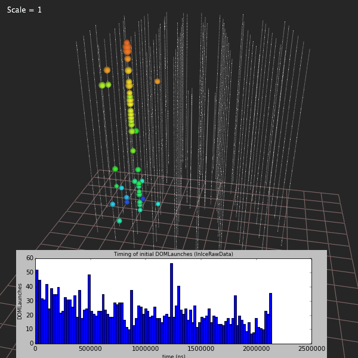
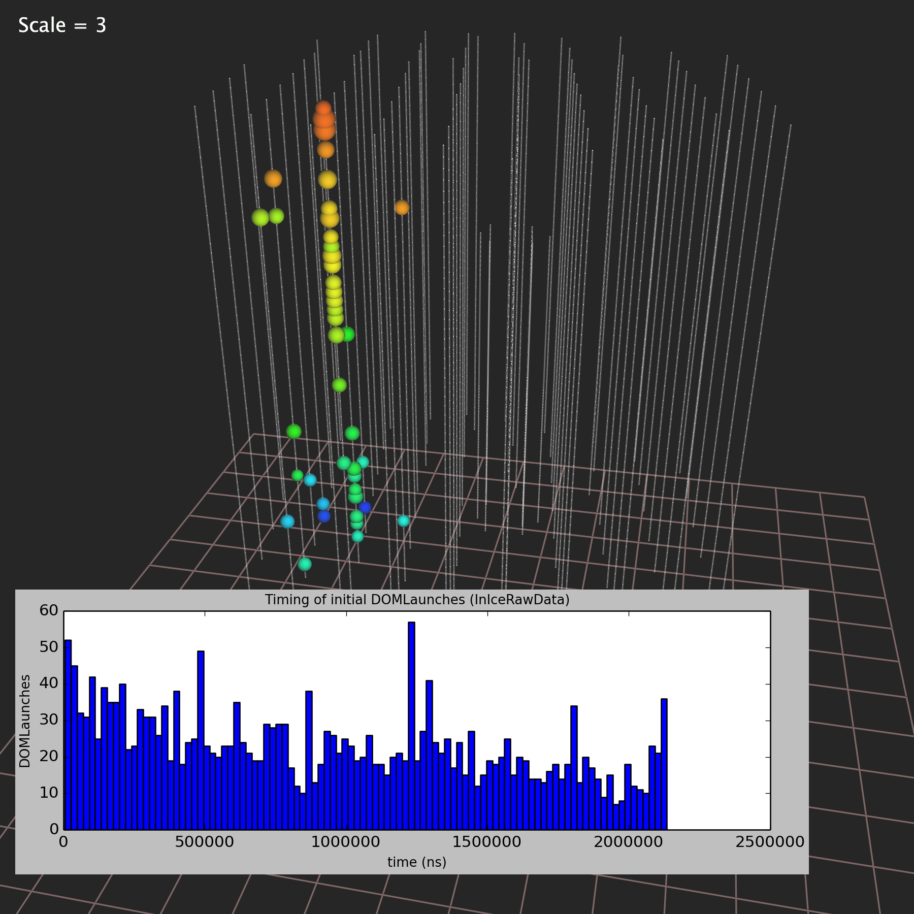
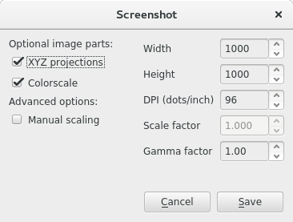
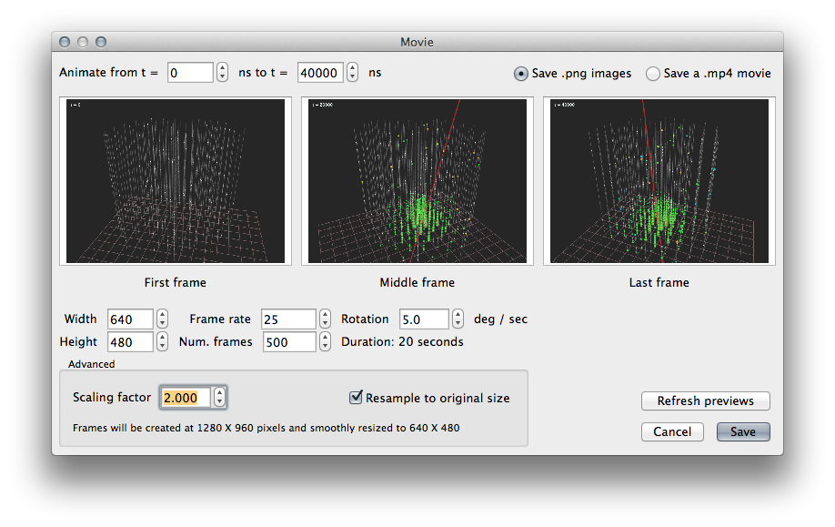

Getting high-quality output
===========================

Steamshovel can produce high-quality graphics suitable for print or the web.

Size, scaling, and DPI
----------------------

There are several related concepts at work when making graphics larger than the
computer screen in front of you:

    - *Actual size*: The size in pixels of a digital image.

    - *Apparent size*: The size at which you expect the image to be viewed.

    - *Density*: The number of pixels per unit area.  This is usually measured
      as dots-per-inch, or DPI, indicating the number of pixels along a linear
      inch.  (Square this value to get dots per square inch.)

    - *Scale*: In steamshovel, pixel-sensitive displays can be scaled up to fit
      into a higher-density image.  For instance, when the image density is doubled,
      text will be drawn at a doubled size to match the new scale, and solid
      lines will be drawn twice as many pixels thick.
      Steamshovel can automatically compute scaling factors when given a target density.

By way of example, here are three screenshots of the same scene, using different DPI
and scaling settings.  All three have the same apparent size.

   Image at 72 dpi, scale = 1.0.  Actual size is 600x600 pixels.

-------

   Image at 144 dpi, scale = 2.0.  Actual size is 1200x1200 pixels.

--------

   Image at 216 dpi, scale = 3.0.  Actual size is 1800x1800 pixels.

Note that DPI is a concept that usually only applies to still images, so we only
refer to density when discussing screenshots.  Videos use the concept of scale
to provide antialiasing (image smoothing).

Saving screenshots
------------------

To more easily capture the currently displayed event, choose the 'Screenshot...'
item from the 'Window' menu. Except for the the table view, this will always
store the data as it is currently displayed in Steamshovel. If the table view is
active, then the 3D view is stored.
No customisation is allowed for this kind of event capture, so this action is
basically a shortcut for printscreen-and-crop.

Creating 3D event projections
-----------------------------

Choose the '3D Projection...' item from the 'Window' menu to see this dialog:

The main view, which is determined based on the COG of the event and the selected track,
is always included.

XYZ projections are three smaller views, optionally included at the top of the image,
with the event viewed from the top and two sides.

A colorscale can be included to show the time range and color mapping of the event.

Choose the width and height of your image: these are the bounding box of the image.
Depending on the selected parts, the aspect ratio of the image will change, but it
will always fit within these dimensions.

Choose a DPI.  300 is a common value for images that will be printed.  For images
that will only be used in digital form, the default is usually fine.

A scaling factor will be chosen automatically based on the DPI you specify.
You can fine-tune it by selecting the checkbox.

A gamma factor different from 1.0 may be chosen. Only the PNG format supports it,
and the result may vary from platform to platform and viewer to viewer. To read the
story how PNG tried to fix something, but made it worse, see
``https://hsivonen.fi/png-gamma``.

Images with a transparent background can be created in the following way:
* Change the background color to solid black
* Produce the screenshot
* Open the screenshot in The Gimp
* Go to the ``Colors`` menu and chose ``Color to Alpha...``
* Turn the color solid black transparent
* Save the result as a PNG or a similar format that stores the alpha channel

Creating Movies
---------------

Choose the 'Movie...' item from the 'Window' menu to see this dialog:

Movies can be saved as a set of png images for further custom processing, or
directly as an .mp4, if ffmpeg or avconv are installed.

The best technique for creating a smooth, high-quality movie is as follows:
Set the 'Width' and 'Height' settings to the desired output size of your movie.
Set the 'Scaling factor' to a value larger than one -- 2 or 4 are good choices.
Finally, select 'Resample to original size.'  This will cause your movie frames
to be generated at a larger resolution and then downscaled, giving the movie
a smooth, antialiased look.

Issues
------

There are some limitations imposed on steamshovel by the underlying graphics drivers,
and for which there is no workaround at current.  One is a limit on total image size.
Steamshovel will do its best to reject screenshot requests that exceed the maximum
size that it can deal with.  However, in some cases, very large screenshots may come
out black.  The best solution is usually to make a small adjustment to the image size.

There exists a maximum width for lines drawn by Steamshovel, which varies from system
to system.  On some Macintosh systems, the maximum line width is 10 pixels.  This means that
lines cannot be scaled above this value, even in high-resoluton screenshots; it may
occasionally cause wide lines to appear unexpectedly thin in high resolution outputs.
The maximum line width is often much higher on Linux.

These limits can be investigated by reading the output of ``window.gl.debugInfo``.  See
the :doc:`steamshovel scripting guide <scripting>`.  Workarounds could be developed for these limits if
necessary, so please let the steamshovel maintainers know if they cause a serious problem for you.
