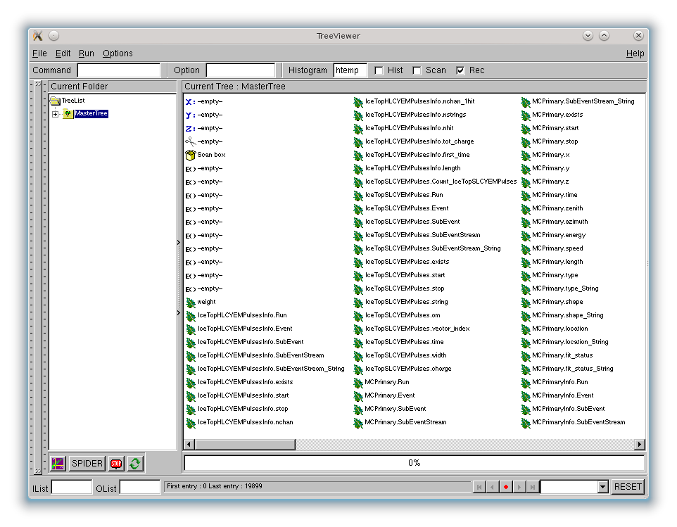

..
.. Copyright  (C) 2010 The Icecube Collaboration
.. SPDX-License-Identifier: BSD-2-Clause
..
.. @author Fabian Kislat <fabian.kislat@desy.de>, $LastChangedBy$

.. highlight:: python

.. _Working-with-tableio-root-files:

Working with tableio .root files
================================

File Structure
^^^^^^^^^^^^^^

:doc:`Rootwriter <index>` creates a :cpp:class:`TTree` for each key you book with
:ref:`tableio-main`. The fields created by the :cpp:class:`I3Converter`
will be branches of this tree. All trees will be stored inside a single
output file along with a *master tree*, which all other trees are
friends of. The master tree is usually called ``MasterTree``, but that
name can be configured (see the documentation of :cpp:class:`I3ROOTTableService`).
All data can be accessed via the master tree.

Thus, if you open a :ref:`tableio-main`\ -created .root file:

.. code-block:: console

    $ root -l output.root

you may find the following contents:

.. code-block:: none

    root [1] .ls
    TFile**         output.root
     TFile*         output.root
      KEY: TTree    IceTopHLCVEMPulsesInfo;1        IceTopHLCVEMPulsesInfo
      KEY: TTree    IceTopSLCVEMPulses;1    IceTopSLCVEMPulses
      KEY: TTree    MCPrimary;1     MCPrimary
      KEY: TTree    MCPrimaryInfo;1 MCPrimaryInfo
      KEY: TTree    CleanedTankPulses;1     CleanedTankPulses
      KEY: TTree    CleanedTankPulsesInfo;1 CleanedTankPulsesInfo
      KEY: TTree    IceTopHLCVEMPulses;1    IceTopHLCVEMPulses
      KEY: TTree    ShowerCOG;1     ShowerCOG
      KEY: TTree    ShowerCombined;1        ShowerCombined
      KEY: TTree    ShowerCombinedInfo;1    ShowerCombinedInfo
      KEY: TTree    ShowerCombinedParams;1  ShowerCombinedParams
      KEY: TTree    ShowerPlane;1   ShowerPlane
      KEY: TTree    ShowerPlaneParams;1     ShowerPlaneParams
      KEY: TTree    MasterTree;1    MasterTree

As mentioned above, all data can be accessed via the ``MasterTree``. You can
check this by having a look at the tree viewer:

.. code-block:: none

    root [2] MasterTree->StartViewer()

The window that opens might look like that:

As you can see, all the other trees show up as if they were branches of
``MasterTree``. The quickest way to create a plot is simply double-clicking
a branch in this viewer.

Tree Structure
^^^^^^^^^^^^^^

:doc:`Rootwriter <index>` :cpp:class:`TTree`\ s are completely flat. Thus, each
branch contains only one leaf. However, branches can be arrays, either of fixed
length (e.g. for filter masks: ``condition_passed`` and ``prescale_passed``) or
variable length (e.g. when booking :cpp:type:`I3RecoPulseSeriesMap`\ s).

Each tree contains at least six branches:

* ``UInt_t Run`` - the run number,
* ``UInt_t Event`` - the event number,
* ``UInt_t SubEvent`` - the sub-event number,
* ``Int_t SubEventStream`` - the ID of the splitter module that made this
  stream,
* ``Char_t SubEventStream_String[]`` - the name of the splitter module that
  made this stream as a string,
* ``Bool_t exists`` - set to false, if the corresponding object did not exist
  in the frame.

In order to align the trees every tree contains one line for each event.
Therefore it is important to always check the value of the branch called
``exists``.

If the object stored in the tree is an array like structure (like e.g. an
:cpp:type:`I3RecoPulseSeriesMap`) the data will be stored in variable-length
arrays and an additional branch is added to the tree

* ``ULong64_t Count_<tree_name>`` - the number of items in the current event.

In case of fixed-length arrays the length is not stored anywhere in the root
file, but it is always the same as defined by the :cpp:class:`I3Converter`.

.. note::

    :cpp:class:`I3FilterResultMapConverter` creates one branch for each filter.
    Each of these branches is an array of two :code:`bool`\ s. The first one
    for the ``condition_passed`` flag, the second one for ``prescale_passed``.

In some cases, fixed and variable-length arrays are combined. For instance,
when booking ATWD waveforms, a branch of type ``double[Count_<tree_name>][128]``
will be created. Each entry will be an array of 128 :code:`double`\ s.

.. note::

    To workaround issues with ROOT's interpretation of branch types,
    :doc:`index` will replace all arrays (not single values) of
    type :code:`char` or :code:`unsigned char` with arrays of
    :c:type:`int16_t` or :c:type:`uint16_t`, respectively. Thus, the tree
    structure might differ from what one would expect from the converter
    implementation.

Besides opening a TreeViewer you can also use :cpp:func:`TTree::Print()` to get
information about the structure of a tree and the stored variable types:

.. code-block:: none

    root [3] IceTopHLCVEMPulses->Print();

    ******************************************************************************
    *Tree    :IceTopHLCVEMPulses: IceTopHLCVEMPulses                             *
    *Entries :   348915 : Total =       417028258 bytes  File  Size =   89738443 *
    *        :          : Tree compression factor =   4.64                       *
    ******************************************************************************
    *Br    0 :Count_IceTopHLCVEMPulses :                                         *
    *         | ULong64_t Number of objects in each field                        *
    *Entries :   348915 : Total  Size=    2828723 bytes  File Size  =     414516 *
    *Baskets :       35 : Basket Size=     386560 bytes  Compression=   6.74     *
    *............................................................................*
    *Br    1 :Run       : UInt_t run number                                      *
    *Entries :   348915 : Total  Size=   18123225 bytes  File Size  =     827981 *
    *Baskets :      202 : Basket Size=    2502144 bytes  Compression=  21.85     *
    *............................................................................*
    *Br    2 :Event     : UInt_t event number                                    *
    *Entries :   348915 : Total  Size=   18123641 bytes  File Size  =    2239237 *
    *Baskets :      202 : Basket Size=    2502144 bytes  Compression=   8.08     *
    *............................................................................*
    *Br    3 :SubEvent  : UInt_t sub-event number                                *
    *Entries :   348915 : Total  Size=   18124266 bytes  File Size  =     875798 *
    *Baskets :      202 : Basket Size=    2502144 bytes  Compression=  20.66     *
    *............................................................................*

    // etc

.. note::

    ``MasterTree->Print()`` will only print the structure of ``MasterTree``,
    which is probably not what you want. You will have to call
    :cpp:func:`Print()` on each tree.

The :ref:`tableio-main` description field is stored in the branch titles. You
can retrieve the description of an individual branch as follows:

.. code-block:: none

    root [4] IceTopHLCVEMPulses->GetBranch("Event")->GetTitle()
    (const char* 0x255e5d8)"event number"

These descriptions are provided by the individual converters and are the
same as those stored in the hdf header. Unfortunately, ROOT trees do not have a
field where the :ref:`tableio-main` unit field can be stored.

Using C++
^^^^^^^^^

Of course, the easiest way to create a plot from a :ref:`tableio-main` root file
is using the :cpp:func:`Draw` method, for instance:

.. code-block:: c++

    MasterTree->Draw("IceTopHLCVEMPulses.charge");

This will fill *all* pulses in *all* events into a histogram.

However, there are more complicated cases, where :cpp:func:`Draw` and simple
cuts are insufficient and you might have to actually loop over the tree
by hand.

To do this, assign a variable to the branches you want to inspect and call
:cpp:func:`TTree::GetEntry()` inside a loop. For example:

.. code-block:: c++

    double energy;
    MasterTree->SetBranchAddress("MCPrimary.energy", &energy);
    for (Long64_t evt = 0; evt < MasterTree->GetEntries(); ++evt) {
        MasterTree->GetEntry(evt);
        // do something with energy
    }

For multi-row tables you will need sufficiently large arrays and make use of
``Count_<tree_name>``:

.. code-block:: c++

    ULong64_t nPulses;
    MasterTree->SetBranchAddress("IceTopHLCVEMPulses.Count_IceTopHLCVEMPulses", &nPulses);
    double charge[MAX_PULSES];    // set MAX_PULSES to a number large enough for any event you might encounter
    MasterTree->SetBranchAddress("IceTopHLCVEMPulses.charge", charge);  // no & before charge!
    for (Long64_t evt = 0; evt < MasterTree->GetEntries(); ++evt) {
        MasterTree->GetEntry(evt);
        for (int i = 0; i < nPulses; ++i) {
            // do something with charge[i]
        }
    }

.. warning::

    You might be tempted to simplify this task using
    :cpp:func:`TTree::MakeClass`. However, this can lead to undesired behaviour
    for multi-row tables. :cpp:func:`TTree::MakeClass()` will allocate arrays for
    these tables whose length is inferred from the longest array occurring in
    the file used when running :cpp:func:`TTree::MakeClass()`. If you then use
    the resulting code to read other files, longer arrays can lead to crashes
    through segmentation faults.

When using this approach you need to know the types of branches created by
converters. The easiest way to find out (besides checking the code) is
:cpp:func:`TTree::Print()` as described above.

Using Python
^^^^^^^^^^^^

.. highlight:: python

PyROOT offers several ways to read data from root trees. In order to work
with pyROOT simply import the ``ROOT`` module and open a file::

    import ROOT

    f = ROOT.TFile('output.root')
    tree = f.MasterTree

Just like in C++ you can then use :func:`TTree.Draw()` to create histograms::

    tree.Draw("log10(MCPrimary.energy)")

Looping over trees is a little simpler in python. All branches of a tree can be
access as attributes of the tree. :class:`TTree`\ s are iterable just as
branches that contain arrays. PyROOT will automatically make sure that all
loops are stopped in time. You do not have to care about the
``Count_<tree_name>`` branch.

An example::

    for event in f.IceTopHLCVEMPulses:
        for charge in event.charge:
            # do something with charge

Unfortunately, this is relatively slow.

.. note::

    While branches are accessible as attributes of a tree, friend trees are not.
    Thus code like ``MasterTree.IceTopHLCVEMPulses.charge`` will not work.

A faster way to loop over trees is to assign variables to branches just as in
C++. In Python this is only possible using :class:`array.array` or
:class:`numpy.array` because you have to pass a pointer to a fixed-type
variable to :func:`TTree.SetBranchAddress()`.

Here is a simple example using :class:`numpy.array`\ s::

    import ROOT
    import numpy as n

    f=ROOT.TFile('output.root')
    t=f.MasterTree

    energy = n.array([0], dtype=n.double)
    t.SetBranchAddress('MCPrimary.energy', energy)

    for evt in range(t.GetEntries()):
        t.GetEntry(evt)
        # do something with energy[0], e.g.
        print energy[0]

In the same way you can also read arrays stored in trees. However, you will
have to know in advance how many entries you will expect. Let's add to the
example above::

    count = n.array([0], dtype=n.uint64)
    MAX_PULSES=324       # for IceTop this is enough
    charge = n.zeros(MAX_PULSES, dtype=n.double)

    t.SetBranchAddress('IceTopHLCVEMPulses.Count_IceTopHLCVEMPulses', count)
    t.SetBranchAddress('IceTopHLCVEMPulses.charge', charge)

    for evt in range(t.GetEntries()):
        t.GetEntry(evt)
        for q in range(count[0]):
            # do something with charge, e.g.
            print charge[q]

The obvious disadvantage of this way is that you have to write just as much
code as in C++.

A note on FilterResultMaps
^^^^^^^^^^^^^^^^^^^^^^^^^^

:cpp:class:`I3FilterResultMapConverter` creates a branch containing an array
of two :code:`bool`\ s for each filter. The first of these two
:code:`bool`\ s stores the ``condition_passed`` flag, the second one the
``prescale_passed`` flag. So to determine the rate of a filter (e.g. for
comparison with monitoring data) you have to look at only one of them, namely
the second one, for example:

.. code-block:: c++

    MasterTree->Draw("FilterMask.IceTopSTA3_11[1]")
